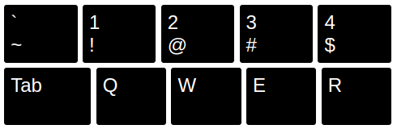

- [Layout](#layout)
- [index.html](#indexhtml)
- [Key](#key)
- [styles.css](#stylescss)
- [Row](#row)
- [Row with extra wide key](#row-with-extra-wide-key)
- [Row with smaller keys](#row-with-smaller-keys)
- [Active key](#active-key)
- [Language switcher](#language-switcher)
- [Conclusion](#conclusion)

In this section we will code simple layout for 3 rows of 5 keys each, to understand: what parameters we should include into HTML [^html] and CSS [^css] to achieve a realistic view. We will use this small test layout as a draft to design a data model and component templates. Then we'll scale it to the whole app (6 rows, 80 keys).

## Layout

Let's take a close look at the physical keyboard to understand its layout.


1. rows have different height (1st is smaller)
2. keys
   - are black rounded rectangles
   - have 0-2 text slots (`1!` or `Q`)
   - have different width (some of them)
   - have the same height inside a row

## index.html

Make a folder for the project `keyboard-trainer`, open it with VS Code [^vscode].

Create a file `index.html`.

In code editor type `!` and press `Tab`, you will see a blueprint with an empty HTML5 [^html5] document [^emmet].

```html
<!DOCTYPE html>
<html lang="en">
	<head>
		<meta charset="UTF-8" />
		<meta http-equiv="X-UA-Compatible" content="IE=edge" />
		<meta name="viewport" content="width=device-width, initial-scale=1.0" />
		<title>Document</title>
	</head>
	<body></body>
</html>
```

Write inside the `<body>` tag something like: “Hello world.”, save the file (Ctrl + s). And run the app with the Live server (click by mouse right button on `index.html` —> Open with Live Server).


Place VS Code on the left side of the screen, and the running app -- on the right side, so you can see immediately how code updates affect the app.

## Key

Remove "Hello world." and write HTML code [^codepronounce] for a single key instead:

```html
<div class="key">
	<div class="main">1</div>
	<div class="shifted">!</div>
</div>
```

And repeat it for a next four keys:

```html
<div class="key">
	<div class="main">`</div>
	<div class="shifted">~</div>
</div>
<div class="key">
	<div class="main">1</div>
	<div class="shifted">!</div>
</div>
<div class="key">
	<div class="main">2</div>
	<div class="shifted">@</div>
</div>
<div class="key">
	<div class="main">3</div>
	<div class="shifted">#</div>
</div>
<div class="key">
	<div class="main">4</div>
	<div class="shifted">$</div>
</div>
```

Result is a column with a plain text: (Look at it in the browser on the right part of your laptop screen)

```
`
1
!
2
@
3
#
4
$
```

It’s time to add some styling.

## styles.css

Create a file `styles.css` next to `index.html`.

Write a style for our keys in it:

```css
.key {
	min-height: 3.4375rem; /*3.4375*16 = 55px*/
	/* 
	rem is a value relative to the default font size of the teg <body> 
	1rem is 16px in our case 
	*/
	background-color: black;
	color: white;
	padding: 0.5rem; /*spacing inside the button*/
	margin: 0.2rem; /*spacing outside the button*/
	border-radius: 0.2rem; /*rounded corners*/
	font-size: 1.5rem;
	cursor: pointer;
}
```

In `index.html`, in the end of `<head>` tag type “link” and press `tab`. There will appear code snippet to CSS import. Then press `ctrl+space` and choose in the menu `styles.css`. Or, if you don’t like using shortcuts, just type this code:

```jsx
<link rel="stylesheet" href="styles.css">
```

Save all changed files `ctrl+k s` (or Menu --> File --> Save All, or with other shortcuts, or save files separately by `ctrl+s`) and you should see the result:


## Row

Wrap all keys in `index.html` with

```html
<div class="row">...here is keys code...</div>
```

Add to `styles.css`:

```css
.row {
	display: flex;
	/* 
	flex-direction: row; - default value
	that's why or divs arranged in a row. 

	Flex is a style for containers to align/justify elements inside them in different ways.
	*/
}
```

Save both files. And you will see the result:


Keys have a minimal width. If we want them to take all available space in the row, we should add to `styles.css`:

```css
.key {
  ...
  flex: 1;
  /*
	1 is proportion relative to other elements in a flex container (row).
	If we set 2 for one of the keys, it will be 2 times wider than other
	*/
}
```

Now the keys look more realistic:


## Row with extra wide key

Let's add a second row with first 5 keys: Tab, Q, W, E, R. Copy all previous code from opening `<div class="row">` to `</div>` and paste it below. Then change text inside each `<div class="key">`

styles.css

```html
...
<div class="row">
	<div class="key">
		<div class="main">Tab</div>
		<div class="shifted"></div>
	</div>
	<div class="key">
		<div class="main">Q</div>
		<div class="shifted"></div>
	</div>
	<div class="key">
		<div class="main">W</div>
		<div class="shifted"></div>
	</div>
	<div class="key">
		<div class="main">E</div>
		<div class="shifted"></div>
	</div>
	<div class="key">
		<div class="main">R</div>
		<div class="shifted"></div>
	</div>
</div>
```

These keys don’t have “shifted” values, just as on the real keyboard.


`Tab` key should have extra width compared to other keys in a row. We need to specify it somehow in `html` and `css`.

index.html

```html
<div class="key Tab">...</div>
```

styles.css

```css
.key.Tab {
	flex: 1.3;
}
```

Now `Tab` has 2 classes: `key` and `Tab`. It allows us to add particular style only for it, in addition to common style `key`.

Result



You see that `Tab` became wider than other keys in the row.

## Row with smaller keys

Copy the first row with all code inside it, and paste it above the first row. Then rewrite content of keys to: Esc, F1, F2, F3, F4, F5.

1st row should have smaller keys than other rows. It means that we need to specify row number in every `<div class="row">`

index.html:

```html
<body>
	<div class="row row-1">
		<div class="key">
			<div class="main">Esc</div>
			<div class="shifted"></div>
		</div>
		<div class="key">
			<div class="main">F1</div>
			<div class="shifted"></div>
		</div>
		<div class="key">
			<div class="main">F2</div>
			<div class="shifted"></div>
		</div>
		<div class="key">
			<div class="main">F3</div>
			<div class="shifted"></div>
		</div>
		<div class="key">
			<div class="main">F4</div>
			<div class="shifted"></div>
		</div>
		<div class="key">
			<div class="main">F5</div>
			<div class="shifted"></div>
		</div>
	</div>
	<div class="row row-2">...</div>
	<div class="row row-3">...</div>
</body>
```

Result


Make 1st row keys smaller with:

styles.css

```css
.row-1 .key {
	min-height: 1rem;
	font-size: 0.7rem;
}
```

Result


Keys of the first row became smaller.

## Active key

One of the keys can be active. Add to any key an additional class "active" and write style to it.

index.html

```html
<div class="key active">
	<div class="main">1</div>
	<div class="shifted">!</div>
</div>
```

styles.css

```css
.key.active {
	background-color: red;
}
```

Result


## Language switcher

It will be 3 circles with language codes. One of them is active and has red background.

index.html

```html
<div class="langSwitcher">
	<div class="lang active">en</div>
	<div class="lang">ru</div>
	<div class="lang">ar</div>
</div>
```

We can make circle from a div with equal width and height (square), and half square width/height border-radius.

A user will feel that elements are clickable, when on hover over them, cursor turns to a hand (pointer), and opacity changes.

styles.css

```css
.lang {
	width: 2rem;
	height: 2rem;
	border-radius: 1rem;
	cursor: pointer;
}

.lang:hover {
	opacity: 0.7;
}

.langSwitcher .active {
	background-color: red;
	color: white;
}
```


Non-active circles haven't background color. That's why we don't see them. And it is ok.

Add styles to justify code vertically and horizontally in the round center:

```css
.lang {
  ...
  display: flex;
  /* flex-direction: row; -- by default */

  justify-content: center; /* position of element related to main flex-direction (row) -- horizontal alignment */

  align-items: center; /* position of element related to additional flex-direction (column) -- vertical alignment */
}
```


Add styles to display language switcher in a row and center it on the page:

```css
.langSwitcher {
	display: flex;
	justify-content: center; /* center horizontally  */
	margin-bottom: 1rem;
}
```

Result


Congratulations. We have made almost the whole html/css layout for our app.

## Conclusion

For now, we have only 3 rows and 16 buttons, and it is already a 90 line HTML file. If we add all 6 rows and 80 buttons, it will be a 500 line HTML file. Our code will become messy and unclear. And this is only for 1 language keyboard, but we want to add another languages too.

In order to make code clear, modular, and maintainable, we should split it into **data** and **view**.

What we have now is an unorganized `view` and `data` mixed together.

While we were doing stuff of this chapter we understood, that we need to specify in the `class` attribute:

- row index `row row-1` for each row, to make all keys inside smaller
- key name `key Tab` for some keys, to make their width larger
- active key `key active` for one of the keys
- active language `lang active` for the language switcher

These are the most important facts about the app `view` and its possible states.

[Entire code after the chapter 2](https://github.com/ApayRus/keyboard/tree/2.-A-mockup--a-basic-HTML/CSS-layout)

[^html]: HTML is a format of web pages -- a markup language and file extension. Any page on the internet is an `*.html` file.
[^css]: CSS is a style system for web pages. If html markups parts of a screen, CSS adds to them size, position, color etc.
[^emmet]: If you are interested in such shortcuts, google `Emmet shortcuts`. Some of them are built in VS Code. Also, you can install extensions with additional shortcuts.
[^vscode]: By default, VS Code opens with a file browser (on the left) and a code editor (on the right). All manipulations on files and folders should be done in the file browser. And all code changes should be done in the code editor.
[^html5]: HTML5 is a relatively new version of HTML, that allows us to play audio on web pages and to do other useful things.
[^codepronounce]: We read/pronounce such a code: A `div` tag [^tag] with a class `key` wraps two `div`s: 1) with a class `main` and content `1`, and with a class `shifted` and content `!`. `class` is an attribute [^attr] of a `div` tag. Or: two `div`s are nested to one `div`.
[^tag]: Code parts like `<div>content</div>` or `<body>content</body>` is called an `html tags`, opening (`<div>`) and closing (`</div>`), and some content inside the tag. Tags split an HTML document into logical parts. We will use only in the whole app only 1 tag -- `<div>`. It is most universal and means `division` -- some place on the screen.
[^attr]: `class="key"` - is an attribute of the tag `<div>`. The `class` attribute allows us to attach styles to the particular `<div>`. Inside the `class` attribute can be listed multiple class names.
