# How to build Keyboard trainer app (html/css/js/?vue)

- [Initial idea and features](#initial-idea-and-features)
- [Idea for an educational project](#idea-for-an-educational-project)
- [Research on similar apps](#research-on-similar-apps)
- [Tools](#tools)
- [Basic HTML/CSS](#basic-htmlcss)
  - [Layout](#layout)
  - [index.html](#indexhtml)
  - [Key](#key)
  - [styles.css](#stylescss)
  - [Row](#row)
  - [Row with extra wide key](#row-with-extra-wide-key)
  - [Row with smaller keys](#row-with-smaller-keys)
  - [Language switcher](#language-switcher)
  - [Conclusion](#conclusion)
- [Data model](#data-model)
  - [Key](#key-1)
  - [Row](#row-1)
  - [Keyboard](#keyboard)
  - [`keyboardData/en.js`](#keyboarddataenjs)
  - [Data source](#data-source)
  - [Conclusion](#conclusion-1)
- [Modularity](#modularity)
  - [JavaScript](#javascript)
  - [Framework](#framework)
    - [Setup](#setup)
    - [Entry point — index.js](#entry-point--indexjs)
    - [Root component — App.js](#root-component--appjs)
  - [Components hierarchy](#components-hierarchy)
    - [App](#app)
    - [LangSwitcher](#langswitcher)
    - [Keyboard](#keyboard-1)
    - [Key](#key-2)
  - [Components (real)](#components-real)
    - [Key](#key-3)
      - [passing prop (v-bind)](#passing-prop-v-bind)
      - [computed (template variables)](#computed-template-variables)
    - [Rows](#rows)
      - [loop in template (v-for)](#loop-in-template-v-for)
      - [1st loop — rows of the keyboard](#1st-loop--rows-of-the-keyboard)
      - [2nd loop — keys of a row](#2nd-loop--keys-of-a-row)
    - [LangSwitcher — refactor with props and v-for](#langswitcher--refactor-with-props-and-v-for)
    - [Dynamic import of `keyboardData`](#dynamic-import-of-keyboarddata)
  - [Conclusion](#conclusion-2)
- [Interactivity](#interactivity)
  - [Reactive state, @click event, calling method](#reactive-state-click-event-calling-method)
  - [Refactor `LangSwitcher`](#refactor-langswitcher)
  - [Conditional styling](#conditional-styling)
  - [Change parent state from a child](#change-parent-state-from-a-child)
  - [Switching keyboards (languages)](#switching-keyboards-languages)
    - [Another languages data](#another-languages-data)
    - [Dynamic import for `keyboardData`](#dynamic-import-for-keyboarddata)
  - [`Keydown` event handling](#keydown-event-handling)
    - [`activeKey` state](#activekey-state)
    - [Operational System (OS) language](#operational-system-os-language)
    - [Active key styling](#active-key-styling)
    - [Fade active key after a while](#fade-active-key-after-a-while)
    - [Set activeKey by click](#set-activekey-by-click)
      - [Method](#method)
      - [Event](#event)
      - [The key full info](#the-key-full-info)
      - [Move `shiftKey` to state](#move-shiftkey-to-state)
      - [Holding `shift` style](#holding-shift-style)
      - [CSS animation (color)](#css-animation-color)
      - [Conditional rendering `v-if`](#conditional-rendering-v-if)
      - [Additional keyframe (0% 30% 100%)](#additional-keyframe-0-30-100)
      - [Animated resize (transform)](#animated-resize-transform)
      - [The value of the pressed key](#the-value-of-the-pressed-key)
  - [Play audio](#play-audio)
    - [Prepare audio files](#prepare-audio-files)
    - [HTML5 audio element](#html5-audio-element)
    - [Data model extension](#data-model-extension)
    - [Testing getAudioFileName](#testing-getaudiofilename)
    - [Dynamic audio playing](#dynamic-audio-playing)
    - [Keyboard layout: global and local parts](#keyboard-layout-global-and-local-parts)
      - [Fallback `keyboardData.en`](#fallback-keyboarddataen)
      - [Method `playKey`](#method-playkey)

## Initial idea and features

When my son was 1.5 y.o. I noticed that he enjoy playing with keyboard, and I thought: it would be good if he get more feedback from the laptop than password hidden symbols on Ubuntu lock screen, or text somewhere as in text editor. The idea became more relevant after a news: “[Two kids found a screensaver bypass in Linux Mint](https://securityaffairs.co/wordpress/113518/hacking/screensaver-bypass-linux-mint.html)” -- it became dangerous to leave a child with Ubuntu lock sreen (joking).

That's how I planned to code a screen keyboard with:

- event handler “on key down”
- popup-like animation highlighting the letter itself and its place on the keyboard,
- playing sound with its name
- switching between languages (English, Arabic, Russian)

## Idea for an educational project

After I made the app, I thought that it can be a good educational project because:

- it emulates a real world complex looking hardware -- it is interesting to reproduce it as an app (digitalize it)
- it is easy to layout with a couple of HTML, CSS tricks
- it touches basic programming topics, like:
  - web app initialization
  - components approach (`App > SwitchLang, Keyboard > Key`)
  - pass parent state to child (via props)
  - change parent state from child (via methods)
  - CSS flex and animation
  - user events handling (keyboard, click, tap)
  - playing sound

I thought after all that `vue without build` will be a good stack for newbies because it hasn't:

- terminal commands (install, run, build)
- side packages (dependencies)
- compiler, bundler settings e.t.c.

You just write components in separate files in a code editor, and they work together as an app without extra steps.

## Research on similar apps

As a smart person (I hope I am), before coding such an app, I did a research to find something similar. And I didn’t find what I wanted. Most similar apps are:

- screen keyboards — allows you to type text without physical keyboard, by clicks/taps on the screen
- keyboard trainers — give predefined text to type, and then give you feedback — did you type right or wrong, and can stop process if you type wrong symbols

Non of these shows/plays additional info about pressed letters (as I know). They are apps for using keyboard in a new way.

My idea was somewhere between these apps. I want informational app, to provide a user with info about pressed keys: how it looks, sounds and what is its official name.

## Tools

1. Install code editor VS Code.
2. Install extension to it: `Live server`. ([How to install Visual Studio Code extensions](https://code.visualstudio.com/learn/get-started/extensions))
3. Install Google Chrome browser

## Basic HTML/CSS

In this section we will code simple layout for 3 rows of 5 keys each, to understand: what parameters we should include into HTML and CSS to achieve a realistic view. We will use this test layout (3 rows, 15 keys) as a draft to design a data model and will scale it to the whole app (6 rows, 80 keys).

### Layout

Let's take a close look at the physical keyboard to understand its layout.

1. rows have different height (1st is smaller)
2. buttons

- are black rounded rectangles
- have 0-2 text slots (`1!` or `Q`)
- have different width (some of them)
- have the same height inside a row

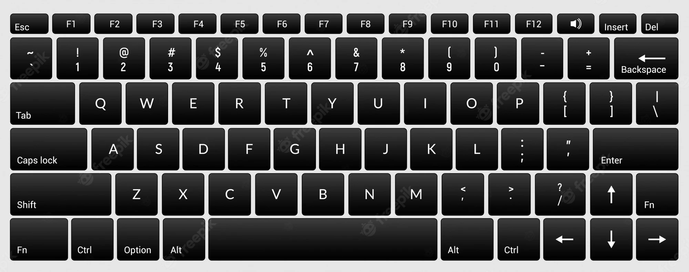

### index.html

Make a folder for the project `keyboard-trainer`, open it with VS code, and create a file `index.html`. Type `!` and press `Tab`, you will see a template for empty HTML5 document. Write inside `<body>` tag something like: “Hello world”, save the file (ctrl+s). And run the app with the Live server (mouse right button click on `index.html` —> Open with Live Server).

Place the code editor on the left side of the screen, and running app on the right side, so you can see immediately how code updates affect on the app.

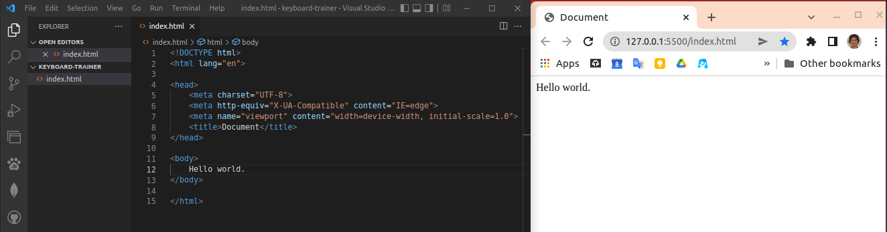

### Key

Let’s write html code for one key:

```html
<div class="key">
	<div class="main">1</div>
	<div class="shifted">!</div>
</div>
```

And repeat it for a next four keys:

```html
<div class="key">
	<div class="main">`</div>
	<div class="shifted">~</div>
</div>
<div class="key">
	<div class="main">1</div>
	<div class="shifted">!</div>
</div>
<div class="key">
	<div class="main">2</div>
	<div class="shifted">@</div>
</div>
<div class="key">
	<div class="main">3</div>
	<div class="shifted">#</div>
</div>
<div class="key">
	<div class="main">4</div>
	<div class="shifted">$</div>
</div>
```

It becomes a plain text column:

```
`
1
!
2
@
3
#
4
$
```

It’s time to add some styling.

### styles.css

Create a file `styles.css` next to `index.html`.

Write in it style for our keys:

```css
.key {
	min-height: 3.4375rem;
	/*3.4375*16 = 55px (16px is default font size)*/
	background-color: black;
	color: white;
	padding: 0.5rem; /*spacing inside the button*/
	margin: 0.2rem; /*spacing outside the button*/
	border-radius: 0.2rem; /*rounded corners*/
	font-size: 1.5rem;
	cursor: pointer;
}
```

In `index.html` in the end of a `<head>` tag type “link” and press `tab`. There will appear import css code template. Then press `ctrl+space` and choose in the menu `styles.css`. Or, if you don’t like using shortcuts, just type this code:

```jsx
<link rel="stylesheet" href="styles.css">
```

Save all changed files `ctrl+k s` (or with other shortcuts, or save files separately by `ctrl+s`) and you should see the result:

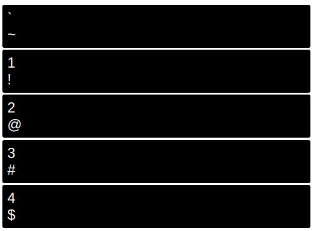

### Row

Wrap all keys in `index.html` with

```html
<div class="row">... here is keys code</div>
```

We need row style to wrap our keys. Add to `styles.css`:

```css
.row {
	display: flex;
	/* 
flex-direction: row; - default value
that's why or divs arranged in a row
*/
}
```

Save both files. And you will see the result:


Keys have a minimal width. If we want them to take all available place in the row, we should add to `styles.css`:

```css
.key {
  ... flex: 1;
  /*
	1 is proportion compared to other elements in a flex row
	if we set 2 for one of keys, it will be 2 times wider than other
	*/
}
```

Now the keys look more realistic:

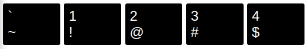

### Row with extra wide key

Lets add a second row with first 5 keys: Tab, Q, W, E, R. Copy all previous code from opening `<div class="row">` to `</div>` and paste it below. Then change text inside each `<div class="key">`:

```html
...
<div class="row">
	<div class="key">
		<div class="main">Tab</div>
		<div class="shifted"></div>
	</div>
	<div class="key">
		<div class="main">Q</div>
		<div class="shifted"></div>
	</div>
	<div class="key">
		<div class="main">W</div>
		<div class="shifted"></div>
	</div>
	<div class="key">
		<div class="main">E</div>
		<div class="shifted"></div>
	</div>
	<div class="key">
		<div class="main">R</div>
		<div class="shifted"></div>
	</div>
</div>
```

Maybe you’ve noticed, that these keys don’t have “shifted” values, and it’s ok, we leave related divs empty.

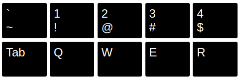

`Tab` key should have extra width compared to other keys in a row. We need to specify it somehow in `html` and `css`.

index.html

```html
<div class="key Tab">...</div>
```

styles.css

```css
.key.Tab {
	flex: 1.3;
}
```

### Row with smaller keys

Actually in the keyboard this row is first. But it is third inside our working process.

Copy the first row with all code inside it, and paste it above the first row. Then rewrite content of keys to: Esc, F1, F2, F3, F4, F5.


1st row should have smaller keys than other rows. It means that we need to specify row number in every `<div class="row">`

index.html:

```html
<div class="row row-1">...</div>
<div class="row row-2">...</div>
<div class="row row-3">...</div>
```

styles.css

```css
.row-1 .key {
	height: 1rem;
	min-height: 1rem;
	font-size: 0.7rem;
}
```

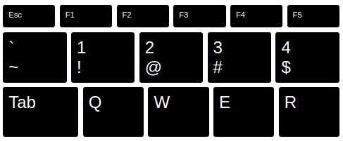

### Language switcher

It will be 3 rounds with language codes. One of them is active (red background).

index.html

```html
<div class="langSwitcher">
	<div class="lang active">en</div>
	<div class="lang">ru</div>
	<div class="lang">ar</div>
</div>
```

To get round we need a div with equal width and height (square) 2rem, and border-radius with half of width/height. Cursor pointer (a hand), and opacity changing on hover invites the user to click the element.

styles.css

```css
.lang {
	width: 2rem;
	height: 2rem;
	border-radius: 1rem;
	cursor: pointer;
}

.lang:hover {
	opacity: 0.7;
}

.langSwitcher .active {
	background-color: red;
	color: white;
}
```

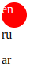

To place lang code in center of the round (vertically and horizontally), add styles:

```css
.lang {
  ... display: flex;
  align-items: center;
  justify-content: center;
}
```

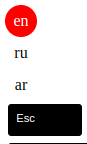

To display lang switcher as a row and center it on the page, add styles:

```css
.langSwitcher {
	display: flex;
	justify-content: center;
	margin-bottom: 1rem;
}
```

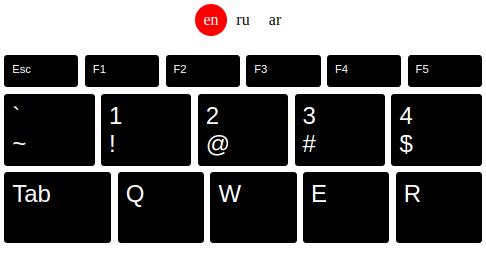

Congratulations. We have made almost all html/css layout for our app. Now we know, that we need to specify:

- row number, to style row keys
- key name, to style key extra width
- active language in a lang switcher

### Conclusion

Now we have 3 rows and 16 buttons, and it is already a 90 line HTML file. If we add all 6 rows and 80 buttons, it will be about a 500 line HTML file for 1 language. Our code becomes messy and not understandable. Also we want to add another languages.

To make code clear, modular, and maintainable, we should split our app into **data** and **view**.

What we have now is an unorganized `view` and `data` mixed together.

## Data model

**Data model** is a set of JS objects that describes all data inside an app.

### Key

Key is an object with the structure:

```javascript
const key = {
	code,
	label,
	main,
	shifted
}
```

Only `code` is required. Other properties are optional.

`code` identifies a place on a physical keyboard. This code is the same for keyboards in all languages.

`label` is the text on the key if it doesn't match with `main` or `code`. For “Escape” `label` is “Esc”, for “Space” it is an empty string.

`main` is the value returned after key pressed.

`shifted` is the value returned after key pressed while holding shift key.

We don't always specify all these props, because sometimes we don’t need them, or they can be calculated from other props. E.g. `Tab` has only `code`, because it doesn’t have a returned value `main` or `shifted`, and its label are the same as the code. `Escape` has `label: Esc` because we want to display on the key shorter version of `code: 'Escape'`. And it also hasn’t returned value (symbol), so it hasn't `main` or `shifted`.

### Row

Row is an array with keys.

```javascript
const row = [key1, key2, key3, ...]
```

### Keyboard

Keyboard is an array with rows.

```javascript
const keyboard = [row1, row2, row3]
```

### `keyboardData/en.js`

Inside root project folder create a new folder `keyboardData` and create there a file `en.js`:

keyboardData/en.js

```javascript
const keyboard = [
	[
		{ code: 'Escape', label: 'Esc' },
		{ code: 'F1' },
		{ code: 'F2' },
		{ code: 'F3' },
		{ code: 'F4' },
		{ code: 'F5' }
	],
	[
		{
			code: 'Backquote',
			main: '`',
			shifted: '~'
		},
		{
			code: 'Digit1',
			main: '1',
			shifted: '!'
		},
		{
			code: 'Digit2',
			main: '2',
			shifted: '@'
		},
		{
			code: 'Digit3',
			main: '3',
			shifted: '#'
		},
		{
			code: 'Digit4',
			main: '4',
			shifted: '$'
		},
		{
			code: 'Digit5',
			main: '5',
			shifted: '%'
		}
	],
	[
		{ code: 'Tab' },
		{
			code: 'KeyQ',
			main: 'q',
			shifted: 'Q'
		},
		{
			code: 'KeyW',
			main: 'w',
			shifted: 'W'
		},
		{
			code: 'KeyE',
			main: 'e',
			shifted: 'E'
		},
		{
			code: 'KeyR',
			main: 'r',
			shifted: 'R'
		}
	]
]

export default keyboard
```

The whole data model is a 2 dimensional array.

```javascript
// you can get any row from keyboard by index:
const row = keyboard[rowIndex]
//rowIndex is 0, 1, ..., 6

// you can get any key from keyboard by 2 indexes
const key = keyboard[rowIndex][keyIndex]
//keyIndex is 0, 1, .., 16
```

### Data source

Where to get the data from?

`main`, `shifted` and `label` are written on keys on phisical keyabord.

We'll explain how to get `code` in the chapter "Event `keydown`".

### Conclusion

We need to have this data model in front of our eyes to design the app in a modular way. We will create small components that are responsible for each logical part of the app. And before we do that, it's important to know wich data will be passed to these components.

## Modularity

What we have written until now are markup and styles.

I am sorry to say, but: HTML and CSS aren't programming languages.

Modularity can be achieved by programming.

### JavaScript

Browser apps are coded in JavaScript (JS).

JS was made in 1995 and DOM (document object model in the browser) — in 1998. Writing code in plain (vanilla) JS and direct manipulations with DOM is kinda hard (and old fashioned).

But there is no alternative to JS.

### Framework

So programmers invented modern frameworks, that make coding web apps easier, clearer and faster. We will use the simplest of them: Vue. Also frameworks allow us to write JS in a '[[yucomponent way.

#### Setup

In index.html comment all code inside tag `<body>`. We need it in the future, but not now.

index.html

```html
<body>
	<!--
    ...
    -->
</body>
```

Copy code example from: https://vuejs.org/guide/quick-start.html#without-build-tools (or from here):

```html
<script src="https://unpkg.com/vue@3"></script>

<div id="app">{{ message }}</div>

<script>
	const { createApp } = Vue

	createApp({
		data() {
			return {
				message: 'Hello Vue!'
			}
		}
	}).mount('#app')
</script>
```

and paste it to index.html after `<body>` tag. If on top of the page appeared “Hello Vue!” it means that setup works.

Even though it works, we need to orginize code better.

#### Entry point — index.js

Put first `<script>` tag into the `<head>` tag.

index.html

```html
<head>
	...
	<script src="https://unpkg.com/vue@3"></script>
</head>
```

Copy second `<script>` tag content (and remove whole tag). Create in project root directory a file `index.js` and paste there what you've copied before.

index.js

```javascript
const { createApp } = Vue

createApp({
	data() {
		return {
			message: 'Hello Vue!'
		}
	}
}).mount('#app')
```

In index.html, just before closing `</body>` tag add string:

index.html

```html
    ...
    <script src="./index.js" type="module"></script>
</body>
```

Attribute `type="module"` allows us to use ES6 feature `import/export`. We need it on the next step.

index.html (result)

```html
<head>
	...
	<script src="https://unpkg.com/vue@3"></script>
</head>
<body>
	<div id="app">{{ message }}</div>
	<!-- ... -->
	<script src="./index.js" type="module"></script>
</body>
```

index.js is called the entry point. It mounts all our app code into `index.html` document.

If you did everything right, you should see "Hello Vue!" at the top of the page as before.

#### Root component — App.js

Open index.js. The code inside createApp(...) is a vue component (root component) — cut it (ctrl+x or copy and delete). We will move it to separate file: App.js — create it in a project root directory. Paste there a code you copied before (ctrl+v) to `const App`. Then export it.

App.js

```javascript
const App = {
	data() {
		return {
			message: 'Hello Vue!!'
		}
	}
}

export default App
```

Then import it in `index.js` and put into createApp(...)

index.js

```javascript
import App from './App.js'

const { createApp } = Vue

createApp(App).mount('#app')
```

If you did everything right, you should see "Hello Vue!" at the top of the page as before.

### Components hierarchy

First we create all components as a colored rectangles to test how works our framework. That’s the hierarchy:

```html
<App>
	<LangSwitcher />
	<Keyboard>
		<Key />
	</Keyboard>
</App>
```

`<App>` is parent for `<LangSwitcher>` and `<Keyboard>`.

`<Keyboard>` is parent for `<Key>`.

`<App>` is grandpa for `<Key>` :smile:.

#### App

We already have `App` component. Just add to

styles.css

```CSS
...
#app {
	background-color: red;
	padding: 10px;
}
```

All styles in this section are temporary, we need them to see nesting of the components. Then we'll delete them.

Now App is a red rectangle.


#### LangSwitcher

Create a directory `components` in the project root directory, and create there a file `LangSwitcher.js`

```javascript
const LangSwitcher = {
	template: `<div class="langSwitcher">LangSwitcher</div>`
}

export default LangSwitcher
```

and add to

styles.css

```CSS
...

.langSwitcher {
	background-color: green;
	padding: 10px;
}
```

Add a newly created component to

App.js

```javascript
import LangSwitcher from './components/LangSwitcher.js'

const App = {
	template: `App <vue-lang-switcher />`,
	components: {
		'vue-lang-switcher': LangSwitcher
	}
}

export default App
```

Result:

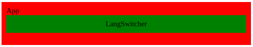

We see here that App contains LangSwitcher wich is correct.

#### Keyboard

Create a file `Keyboard.js` in a `components` folder

Keyboard.js

```javascript
const Keyboard = {
	template: `<div class="keyboard">Keyboard</div>`
}

export default Keyboard
```

Add to

styles.css

```css
... .keyboard {
	background-color: blue;
	padding: 10px;
	display: flex; /*to display keys in a row, on next step*/
}
```

Add a new component Keyboard to

App.js

```javascript
import Keyboard from './components/Keyboard.js'
import LangSwitcher from './components/LangSwitcher.js'

const App = {
	template: `App 
	<vue-lang-switcher />
	<vue-keyboard />
	`,
	components: {
		'vue-lang-switcher': LangSwitcher,
		'vue-keyboard': Keyboard
	}
}

export default App
```

Now the app looks like:

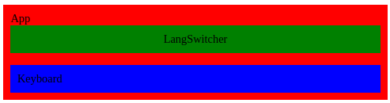

#### Key

Create file `Key.js` in `components` directory

Key.js

```javascript
const Key = {
	template: `<div class="key">Key</div>`
}

export default Key
```

Add to

styles.css

```css
.key {
	background-color: yellow;
	padding: 10px;
	color: black;
}
```

As you remember `Key` is the child of `Keyboard` so it should be imported in `Keyboard`, not in `App.js`.

Keyboard.js

```javascript
import Key from './Key.js'

const Keyboard = {
	template: `<div class="keyboard">
                    Keyboard
                    <vue-key />
                    <vue-key />
                    <vue-key />
                </div>`,
	components: {
		'vue-key': Key
	}
}

export default Keyboard
```

After saving all files, that’s how our app looks:

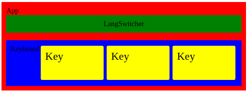

Our component hierarchy works well. All components have correct nesting. How we said it the beginning of the chapter:

> `<App>` is parent for `<LangSwitcher>` and `<Keyboard>`.
> `<Keyboard>` is parent for `<Key>`.

### Components (real)

For now our components are a colored rectangles with some static content (text). In real components all content is dynamic, passed by `props`.

Props are external params (variables) that we pass from parent to child.

The idea of a component is that we recieve external data from parent (`props`), and put them into html-like template with empty slots for these props.

#### Key

##### passing prop (v-bind)

Open `index.html`, copy one of the key code, that we commented before, and paste it to template in

Key.js

```javascript
const Key = {
	template: `<div class="key">
                                <div class="main">1</div>
                                <div class="shifted">!</div>
                            </div>`
}

export default Key
```

We described our ["Data model"](#data-model) in a section above. Open `keyboardData/en.js` and find the data for a single key:

keyboardData/en.js

```javascript
{
	code: 'Digit1',
	main: '1',
	shifted: '!',
	mainName: 'one',
	shiftedName: 'exclamation mark'
}
```

copy it.

We will pass this object to `Key` component as a prop `keyContent`.

Keyboard.js

```javascript
import Key from './Key.js'

const keyData = {
	/*paste here copied data*/ code: 'Digit1',
	main: '1',
	shifted: '!',
	mainName: 'one',
	shiftedName: 'exclamation mark'
}

const Keyboard = {
	template: `<div class="keyboard">
                        Keyboard
                        <vue-key :keyContent="keyData" />
		    </div>`,
	components: {
		'vue-key': Key
	},
	data() {
		return { keyData }
	}
}

export default Keyboard
```

Here we:

- described data of Key in `const keyData`
- made the component see this data with `data(){}` method
- passed `keyData` as a prop to child `Key` component

Notice, when we pass prop, we use colon `:` before its name.

```js
<vue-key :keyContent="keyData" />
```

In that case framework interpet “keyData” as a variable name.

Otherwise (wihout `:`) it would be interpreted as a string.

`<vue-key keyContent="keyData" />` —> Key component will recieve string “keyData” instead of the object `keyData`.

Now we should warn `Key` about a new prop.

Key.js

```javascript=
const Key = {
  template: `<div class="key">
                        <div class="main">
                            {{ keyContent.main }}
                        </div>
                        <div class="shifted">
                            {{ keyContent.shifted }}
                        </div>
                    </div>`,
  props: {
    keyContent: Object
  }
}

export default Key
```

1. We told component about a prop `props: {keyContent: Object}`
2. We told template how to use props by `{{ }}`.

Result:


Return to `Keyboard.js`. We already have all key data in `keyboardData/en.js` so let’s import and use it, instead of a single key data:

Keyboard.js

```javascript
import Key from './Key.js'
import keyboardData from '../keyboardData/en.js'

const Keyboard = {
	template: `<div class="keyboard">
                        Keyboard
                        <vue-key :keyContent="keyboardData[1][0]" />
                        <vue-key :keyContent="keyboardData[1][1]" />
                        <vue-key :keyContent="keyboardData[1][2]" />
                        <vue-key :keyContent="keyboardData[1][3]" />
                        <vue-key :keyContent="keyboardData[1][4]" />
                        <vue-key :keyContent="keyboardData[1][5]" />
                    </div>`,
	components: {
		'vue-key': Key
	},
	data() {
		return { keyboardData }
	}
}

export default Keyboard
```

Now we have less code and more keys:


##### computed (template variables)

If we try to display first row `keyboardData[0]` (Esc, F1, F2, …)

```javascript
    ...
    template: `<div class="keyboard">
                        <vue-key :keyContent="keyboardData[0][0]" />
                        <vue-key :keyContent="keyboardData[0][1]" />
                        <vue-key :keyContent="keyboardData[0][2]" />
                        <vue-key :keyContent="keyboardData[0][3]" />
                        <vue-key :keyContent="keyboardData[0][4]" />
                        <vue-key :keyContent="keyboardData[0][5]" />
                </div>`,
    ...
```

we will get empty yellow rectangles:


That’s because these keys doesn’t have `main` or `shifted` values:

```javascript
;[
	{ code: 'Escape', label: 'Esc' },
	{ code: 'F1' },
	{ code: 'F2' },
	{ code: 'F3' },
	{ code: 'F4' },
	{ code: 'F5' }
]
```

So we need to compute them from other params: `code` and `label`. Vue component has especial property `computed` for such computations.

Key.js

```javascript
const Key = {
	template: `<div class="key">
                        <div class="main">
                            {{main}}
                        </div>
                        <div class="shifted">
                            {{shifted}}
                        </div>
                    </div>`,
	props: {
		keyContent: Object
	},
	computed: {
		main() {
			const { main, label, code } = this.keyContent
			return label || main || code
		},
		shifted() {
			const { shifted } = this.keyContent
			return shifted
		}
	}
}

export default Key
```

We added to component object a new property `computed` with 2 methods: `main()` and `shifted()`. Also we changed `template` to use this new values:

`{{keyboardData.main}}` —> `{{main}}`

`{{keyboardData.shifted}}` —> `{{shifted}}`

Result:


Before we output all rows, remove all temporary styles, that we added to see how component hierarchy works. Remove these lines from the end of

styles.css

```css
#app {
	background-color: red;
	padding: 10px;
}

.langSwitcher {
	background-color: green;
	padding: 10px;
}

.keyboard {
	background-color: blue;
	padding: 10px;
	display: flex;
}

.key {
	background-color: yellow;
	padding: 10px;
	color: black;
}
```

Let’s ouput all rows from our data model

Keyboard.js

```javascript
...
template: `<div class="keyboard">
                <div class="row row-1">
                    <vue-key :keyContent="keyboardData[0][0]" />
                    <vue-key :keyContent="keyboardData[0][1]" />
                    <vue-key :keyContent="keyboardData[0][2]" />
                    <vue-key :keyContent="keyboardData[0][3]" />
                    <vue-key :keyContent="keyboardData[0][4]" />
                    <vue-key :keyContent="keyboardData[0][5]" />
                </div>
                <div class="row row-2">
                    <vue-key :keyContent="keyboardData[1][0]" />
                    <vue-key :keyContent="keyboardData[1][1]" />
                    <vue-key :keyContent="keyboardData[1][2]" />
                    <vue-key :keyContent="keyboardData[1][3]" />
                    <vue-key :keyContent="keyboardData[1][4]" />
                    <vue-key :keyContent="keyboardData[1][5]" />
                </div>
                <div class="row row-3">
                    <vue-key :keyContent="keyboardData[2][0]" />
                    <vue-key :keyContent="keyboardData[2][1]" />
                    <vue-key :keyContent="keyboardData[2][2]" />
                    <vue-key :keyContent="keyboardData[2][3]" />
                    <vue-key :keyContent="keyboardData[2][4]" />
                </div>
            </div>`,
...
```

We wrapped rows with `<div class="row row-{{index}}">...</div>`.

Result:


Last line looks not correct.

For languages with upper case letters (e.g. cyrillic, latin alphabets), we should show in main slot `shifted` value (uppercase), and don't show `main` value at all. Otherwise it makes our keaboard lookin unrealistic and overwhelmed. We add function `getKeyLabels(keyContent)` that does all this work for us:

Key.js

```javascript
const getKeyLabels = keyContent => {
	const { main = '', shifted = '', label, code } = keyContent
	const isUpperCaseLang = main.toUpperCase() === shifted
	const mainOutput = isUpperCaseLang ? shifted : main
	const shiftedOutput = isUpperCaseLang ? '' : shifted

	return {
		main: label || mainOutput || code,
		shifted: shiftedOutput
	}
}

const Key = {
	template: `<div class="key">
                        <div class="main">{{main}}</div>
                        <div class="shifted">{{shifted}}</div>
                    </div>`,
	props: {
		keyContent: Object
	},
	computed: {
		main() {
			const { main } = getKeyLabels(this.keyContent)
			return main
		},
		shifted() {
			const { shifted } = getKeyLabels(this.keyContent)
			return shifted
		}
	}
}

export default Key
```

In `main()` and `shifted()` we use the new function `getKeyLabels`.

Result is ok:


#### Rows

##### loop in template (v-for)

Keyboard.js

Did you already think that it is annoying to ouput data with template in such way:

Keyboard.js

```javascript
...
template: `<div class="keyboard">
                <div class="row row-1">
                    <vue-key :keyContent="keyboardData[0][0]" />
                    <vue-key :keyContent="keyboardData[0][1]" />
                    <vue-key :keyContent="keyboardData[0][2]" />
                    <vue-key :keyContent="keyboardData[0][3]" />
                    <vue-key :keyContent="keyboardData[0][4]" />
                    <vue-key :keyContent="keyboardData[0][5]" />
                </div>
                <div class="row row-2">
                    <vue-key :keyContent="keyboardData[1][0]" />
                    <vue-key :keyContent="keyboardData[1][1]" />
                    <vue-key :keyContent="keyboardData[1][2]" />
                    <vue-key :keyContent="keyboardData[1][3]" />
                    <vue-key :keyContent="keyboardData[1][4]" />
                    <vue-key :keyContent="keyboardData[1][5]" />
                </div>
                <div class="row row-3">
                    <vue-key :keyContent="keyboardData[2][0]" />
                    <vue-key :keyContent="keyboardData[2][1]" />
                    <vue-key :keyContent="keyboardData[2][2]" />
                    <vue-key :keyContent="keyboardData[2][3]" />
                    <vue-key :keyContent="keyboardData[2][4]" />
                </div>
            </div>`,
...
```

`v-for` directive allows us to loop elements in template.

We could guess by template structure , that there are 2 nested loops.

- 1st for rows
- 2nd for keys inside the row

##### 1st loop — rows of the keyboard

First let’s ouput just row containers.

Keyboard.js

```javascript
import Key from './Key.js'
import keyboardData from '../keyboardData/en.js'

const Keyboard = {
	template: `<div class="keyboard">
                        <div 
                            v-for="(row, index) in keyboardData"
                            :class="['row', 'row-'+(index+1)]" 
                        >
                            row {{index+1}}
                        </div>
                    </div>`,
	components: {
		'vue-key': Key
	},
	data() {
		return { keyboardData }
	}
}

export default Keyboard
```

`v-for="(row, index) in keyboardData"` loops through `keyboardData` array.

On each iteration `v-for` creates the same element (like element that contains `v-for`), with 2 new params: `index` and `row` that we can use inside our template. For now we use only index.

Result:


`:class="['row', 'row-'+(index+1)]"` generates `class="row row-1"` e.t.c. Сolon `:` tells framework that class value should be interpreted as a varible, not string. We use in class a variable `index` gotten from `v-for`.

On the image above there is opened Developer tools. (In browser click mouse right button —> Inspect).

In the code (DevTools tab `elements`) we see that each row are represented by a `div` with classes `row` and `row-index`. That’s important for us, because 1st row has different styles: smaller buttons and font size, if you remember.

```javascript
<vue-key
	v-for="keyContent in row"
	:keyContent="keyContent"
/>
```

##### 2nd loop — keys of a row

In `Keyboard.js` let’s replace `row {{index+1}}` with another loop with keys.

This template part recieves `row` from the loop before, and makes another loop for keys of the `row`.

Keyboard.js

```javascript
import Key from './Key.js'
import keyboardData from '../keyboardData/en.js'

const Keyboard = {
	template: `<div class="keyboard">
                        <div 
                            v-for="(row, index) in keyboardData" 
                            :class="['row', 'row-'+(index+1)]"
                        >
                        <vue-key 
                            v-for="keyContent in row" 
                            :keyContent="keyContent" 
                        />
                        </div>
                    </div>`,
	components: {
		'vue-key': Key
	},
	data() {
		return { keyboardData }
	}
}

export default Keyboard
```

Result:


Add to `keyboardData/en.js` a new key F6 and you'll see the result immidiatly.

Now we don’t care even if our keyboard data contains hundreds of rows and keys — they will be displayed automatically by the 2 loops, with these 25 lines of code. **We separated view and data**.

#### LangSwitcher — refactor with props and v-for

Open `index.html` and copy commented code for `LangSwitcher`, then paste it to `template` in

LangSwitcher.js

```javascript
const LangSwitcher = {
	template: `<div class="langSwitcher">
                            <div class="lang active">en</div>
                            <div class="lang">ru</div>
                            <div class="lang">ar</div>
                    </div>`
}

export default LangSwitcher
```

Result:


The idea is to move the red round to the lang code that we clicked. Also we need to store selected lang in some variable. Smells as reactivity, yeah?

But first we rewrite LangSwitcher with `props` and `v-for`.

In `App.js` we add a new param `langs` to `data()`. Then in `template` we pass it to `<vue-lang-switcher />`

App.js

```javascript
import Keyboard from './components/Keyboard.js'
import LangSwitcher from './components/LangSwitcher.js'

const App = {
	template: `App 
	<vue-lang-switcher :langs="langs" />
	<vue-keyboard />
	`,
	components: {
		'vue-lang-switcher': LangSwitcher,
		'vue-keyboard': Keyboard
	},
	data() {
		return {
			langs: ['en', 'ru', 'ar']
		}
	}
}

export default App
```

In `<LangSwitcher.js>` we recieve this new param (array) `langs`, and ouput it in a loop with `v-for`.

LangSwitcher.js

```javascript
const LangSwitcher = {
	template: `<div class="langSwitcher">
                        <div 
                            v-for="lang in langs" 
                            class="lang"
                        >
                            {{lang}}
                        </div>
                    </div>`,
	props: {
		langs: Array
	}
}

export default LangSwitcher
```

Result:


The red round disappeared because style `active` not attached to any element.

#### Dynamic import of `keyboardData`

For now we have only 1 keyboard layout -- English (en). But then we will have different layouts (langs), so we need a feature to load them from different files.

Open `Keyboard.js` and:

- add `mounted()`, and load there `keyboardData` from a file
- update state with received data

Keyboard.js

```js
import Key from './Key.js'
/* delete: 
import keyboardData from '../keyboardData/en.js'
* we receive it from prop 
*/

const Keyboard = {
	template: `
  <div class="keyboard">
      <div 
          v-for="(row, index) in keyboardData" 
          :class="['row', 'row-'+(index+1)]"
      >
          <vue-key 
              v-for="keyContent in row" 
              :keyContent="keyContent" 
          />
      </div>
  </div>
`,
	components: {
		'vue-key': Key
	},
	/* add: */
	mounted() {
		/* dynamic import from file */
		import(`./keyboardData/en.js`).then(result => {
			const { default: keyboardData } = result
			/* update state with received data */
			this.keyboardData = keyboardData
		})
	},
	data() {
		return { keyboardData: [] }
	}
}

export default Keyboard
```

Method `mounted()` will be called when user opens the app at the first time.

`import('path-to-file')` works as `import` in the top of a page. But you can put it anywhere and call it anytime. It is a promise (works asynchronous), so it returns after a while a `result` -- object `{default: }` with code from an external module. We wait it and `.then` we use received code (`keyboardData/en.js`) to update our `Keyboard` state.

If you have done everything right, the app will work just as before, without any visible changes. But we made our code better. Now we import `keyboardData` dynamically, that allows us to switch between different language keyboards on a next steps.

### Conclusion

What we coded until now are a static elements, that doesn’t react on user input, and doesn’t change dynamically (except dynamic import of a `keyboardData`, but for now it happens without user interaction).

By using components with props we made our code modular.

By using loops in templates we made code short, clear, extensible, and maintainable. Now we can display data of any length with a small template within a loop.

## Interactivity

Interactivity it is when a user interacts with an app, and see results.

Our app should handle user generated events.

### Reactive state, @click event, calling method

When we change a component variable value (state), and it causes change in a visible app (view), it is called **reactive state**. Reactivity means connection between component variables and view.

- In `vue` such **reactive variables** should be placed in the method `data()`.
- The most common approach to change them — by **methods**.
- Methods are called from **event listeners** placed in a template (e.g. `@click`).

### Refactor `LangSwitcher`

Let’s we add to `LangSwitcher`:

- a method `data()` with a returned property (state) `currentLang: 'en'` (‘en’ as default)
- a property `methods` with a new method `switchLang(lang)`
- in the template
  - a new event handler @click to element `<div class="lang">`
  - a new `div` to display reactive variable `currentLang`. It is temporary, after testing we’ll delete it.

LangSwitcher.js

```jsx
const LangSwitcher = {
	template: `
	<div class="langSwitcher">
		<div 
			v-for="lang in langs" 
			class="lang"
			@click="switchLang(lang)"
		>
			{{lang}}
		</div>
    </div>
	<div style="text-align: center;">
		{{currentLang}}
	</div>`,
	props: {
		langs: Array
	},
	data() {
		return {
			currentLang: 'en'
		}
	},
	methods: {
		switchLang(lang) {
			this.currentLang = lang
		}
	}
}

export default LangSwitcher
```

`@click="switchLang(lang)"` -- by clicking on an element where it placed (`<div class=”lang”>`) will be called method `switchLang` with a parameter `lang` particular to each `<div>` and can be ‘en’, ‘ru’, ‘ar’.

That’s how **a user input (click) on dynamic generated elements changes a reactive state**.

Result:


You see that after a click on a lang code, component `currentLang` state changes in the `div` below.

### Conditional styling

Instead of the `currentLang` text we need a red round background under the active lang.

Conditional styling it is when we apply some styling to an element, only if a condition is true.

`:class='["lang", {active: currentLang === lang}]'` this string will do all work for us.

1-st element in the array is a string, that means that the class `lang` will be attached to `<div>` in any case (without condition).

2-nd element is an object like `{styleName: booleanCondition}`. Class `active` will be attached to `<div class="lang">` only if the prop `lang` of the element is equal to the state `currentLang`.

In `styles.css` we defined before:

```css
.lang {
	width: 2rem;
	height: 2rem;
	border-radius: 1rem;
	...;
}

.langSwitcher .active {
	background-color: red;
	color: white;
}
```

That’s why the red round follows our clicks on lang codes — because of attaching and detaching the class `active`.

Result:


### Change parent state from a child

Another important approach to share data between components — is changing parent state from a child. It is kinda opposite to passing props from parent to child.

- In a parent we create a reactive state and a method to change it
- we pass this method to child as a prop
- we call it (with params) from the child

When you call a method received from a prop, notice that actually it happens where it was defined.

If the parent state was passed as a prop to multiple components, if we change this state (from any child, by method received as a prop) — then all components with this state (as prop) will be updated. That is how a little child component from hierarchy bottom can globally affect on the whole app — by calling a method, that changes parent state.

In a small apps as our, it is common to have reactive state and main logic in the top level component as `<App>` and pass the state and methods to children (`<Keyboard>`, `<LangSwitcher>`) as props.

For now `currentLang` is placed in `<LangSwitcher>`. But we need this value also in `<Keyboard>` and `<Key>`.

`<LangSwitcher>` and `<Keyboard>` are siblings, they haven’t parent-child relations, but have common parent. So, to share the state `currentLang` between siblings, we should lift it up to the common ancestor `<App>`.

Let’s we move state `currentLang` and method `switchLang` from `<LangSwitcher>` to `<App>` and then pass them as props to `<LangSwitcher>` and use them there.

Open `LangSwitcher.js` and remove `data()` and `methods`. Add to props: `currentLang`, `switchLang`.

```javascript
const LangSwitcher = {
	template: `
	<div class="langSwitcher">
		<div 
			v-for="lang in langs" 
			:class='["lang", {active: currentLang === lang}]'
			@click="switchLang(lang)"
		>
			{{lang}}
		</div>
	</div>`,
	props: {
		langs: Array,
		/* add: */
		currentLang: String,
		switchLang: Function
	}
	/* delete: 
	data() {
		return {
			currentLang: 'en'
		}
	},
	methods: {
		switchLang(lang) {
			this.currentLang = lang
		}
	} 
	*/
}

export default LangSwitcher
```

Open `App.js`. Add to `data()` a new state `currentLang: 'en'`. Paste whole `methods` from old `LangSwitcher.js`.

In the `template`

- pass to `<vue-lang-switcher>` 2 new props: `switchLang` and `currentLang`
- add `{{currentLang}}` to test our changes.

App.js

```javascript
import Keyboard from './components/Keyboard.js'
import LangSwitcher from './components/LangSwitcher.js'

const App = {
	template: `App-{{currentLang}}
	<vue-lang-switcher 
		:langs="langs" 
		:switchLang="switchLang" 
		:currentLang="currentLang" 
	/>
	<vue-keyboard />
	`,
	components: {
		'vue-lang-switcher': LangSwitcher,
		'vue-keyboard': Keyboard
	},
	mounted() {
		import(`./keyboardData/en.js`).then(result => {
			const { default: keyboardData } = result
			this.keyboardData = keyboardData
		})
	},
	data() {
		return {
			langs: ['en', 'ru', 'ar'],
			/* add: */
			currentLang: 'en'
		}
	},
	/* add: */
	methods: {
		switchLang(lang) {
			this.currentLang = lang
		}
	}
}

export default App
```

Result:


Notice, when we do something in `LangSwitcher` it changes `App` state. We change the parent state from the child with the method that we passed from the parent to the child as a prop.

### Switching keyboards (languages)

#### Another languages data

Open a folder `keyboardData`. Copy and paste there a file `en.js` twice. Rename clones to `ru.js` and `ar.js`. Change a content (copy from here or type).

ru.js

```javascript
const keyboard = [
	[
		{ code: 'Escape', label: 'Esc' },
		{ code: 'F1' },
		{ code: 'F2' },
		{ code: 'F3' },
		{ code: 'F4' },
		{ code: 'F5' },
		{ code: 'F6' }
	],
	[
		{
			code: 'Backquote',
			main: 'ё',
			shifted: 'Ё'
		},
		{
			code: 'Digit1',
			main: '1',
			shifted: '!'
		},
		{
			code: 'Digit2',
			main: '2',
			shifted: '"'
		},
		{
			code: 'Digit3',
			main: '3',
			shifted: '№'
		},
		{
			code: 'Digit4',
			main: '4',
			shifted: ';'
		},
		{
			code: 'Digit5',
			main: '5',
			shifted: '%'
		}
	],
	[
		{ code: 'Tab' },
		{
			code: 'KeyQ',
			main: 'й',
			shifted: 'Й'
		},
		{
			code: 'KeyW',
			main: 'ц',
			shifted: 'Ц'
		},
		{
			code: 'KeyE',
			main: 'у',
			shifted: 'У'
		},
		{
			code: 'KeyR',
			main: 'к',
			shifted: 'К'
		}
	]
]

export default keyboard
```

ar.js

```javascript
const keyboard = [
	[
		{ code: 'Escape', label: 'Esc' },
		{ code: 'F1' },
		{ code: 'F2' },
		{ code: 'F3' },
		{ code: 'F4' },
		{ code: 'F5' },
		{ code: 'F6' }
	],
	[
		{
			code: 'Backquote',
			main: '٫',
			shifted: '٬'
		},
		{
			code: 'Digit1',
			main: '١',
			shifted: '!'
		},
		{
			code: 'Digit2',
			main: '٢',
			shifted: '@'
		},
		{
			code: 'Digit3',
			main: '٣',
			shifted: '#'
		},
		{
			code: 'Digit4',
			main: '٤',
			shifted: '$'
		},
		{
			code: 'Digit5',
			main: '٥',
			shifted: '٪'
		}
	],
	[
		{ code: 'Tab' },
		{
			code: 'KeyQ',
			main: 'ض',
			shifted: 'َ'
		},
		{
			code: 'KeyW',
			main: 'ص',
			shifted: 'ً'
		},
		{
			code: 'KeyE',
			main: 'ث',
			shifted: 'ُ'
		},
		{
			code: 'KeyR',
			main: 'ق',
			shifted: 'ٌ'
		}
	]
]

export default keyboard
```

Arabic diacritic symbols aren't looking good in the code. But don't worry about it. It will work well for our purposes.

#### Dynamic import for `keyboardData`

In App.js pass `currentLang` to `Keyboard`.

App.js template

```html
<vue-keyboard :currentLang="currentLang" />
```

In `Keyboard.js`:

- receive the new prop
- watch its changes
- add a new method `getKeyboardData`
- call `getKeyboardData` on `mounted()` and if prop `currentLang` changed

Keyboard.js

```js
import Key from './Key.js'

const Keyboard = {
	template: `
  <div class="keyboard">
		<div
			v-for="(row, index) in keyboardData"
			:class="['row', 'row-'+(index+1)]"
		>
			<vue-key
				v-for="keyContent in row"
				:keyContent="keyContent"
			/>
		</div>
  </div>
`,
	components: {
		'vue-key': Key
	},
	data() {
		return { keyboardData: [] }
	},
	/* receive a new prop  */
	props: {
		currentLang: String
	},
	watch: {
		/* add function, that will be called when prop changes */
		currentLang: function (currentLang) {
			this.getKeyboardData(currentLang)
		}
	},
	/* happens when app opened for the first time */
	mounted() {
		this.getKeyboardData(currentLang)
	},
	methods: {
		async getKeyboardData(lang) {
			const { default: keyboardData } = await import(
				`../keyboardData/${lang}.js`
			)
			this.keyboardData = keyboardData
		}
	}
}

export default Keyboard
```

If you noticed `async/await` in the method `getKeyboardData` -- that is an alternative syntax for promises. This code is asynchronous, because reading of a file takes time and we should wait for result to move further through our scenario.

Result:


With a few lines of code we achieved a big improvement of functionality. That is because we organized code well: in a modular way, with an intuitive props, methods, and structure.

### `Keydown` event handling

In the file `Keyboard.js` add to `mounted()` an event listener on `keydown`:

```javascript
	mounted() {
		this.getKeyboardData(this.currentLang)

		/* add: */
		window.addEventListener('keydown', event => {
			e.preventDefault()
			console.log(event)
		})
	},
```

Save the file. Click with mouse on the app to make the window active to catch events from it.

Open Chrome dev tools tab `console`, and look at events. They will appear in a console when you press buttons on a keyboard.


Experiment with different keys and see result. Expand `KeyboardEvent` and look at its properties. We need only 3 of them: `code`, `key`, and `shiftKey`.

Close console (Dev tools).

#### `activeKey` state

In `Keyboard.js`, add a new state `activeKey`. It will be filled by `event` with `{ code, key, shiftKey }`. Add to template `activeKey` to see how it changes.

Keyboard.js

```js
import Key from './Key.js'

const Keyboard = {
	template: `
	<div>activeKey: {{activeKey}}</div>
	<div class="keyboard">
		<div
			v-for="(row, index) in keyboardData"
			:class="['row', 'row-'+(index+1)]"
		>
			<vue-key
				v-for="keyContent in row"
				:keyContent="keyContent"
			/>
		</div>
	</div>`,
	components: {
		'vue-key': Key
	},
	data() {
		return {
			keyboardData: [],
			/* add: */
			activeKey: { code: '' }
		}
	},
	props: {
		currentLang: String
	},
	watch: {
		currentLang: function (currentLang) {
			this.getKeyboardData(currentLang)
		}
	},
	mounted() {
		this.getKeyboardData(this.currentLang)

		window.addEventListener('keydown', event => {
			event.preventDefault()
			/* add: (read particular props of event) */
			const { code, key, shiftKey } = event
			/* write event parts to the state: */
			this.activeKey = { code, key, shiftKey }
		})
	},

	methods: {
		async getKeyboardData(lang) {
			const { default: keyboardData } = await import(
				`../keyboardData/${lang}.js`
			)
			this.keyboardData = keyboardData
		}
	}
}

export default Keyboard
```

Press `q, w` in all lang layouts (`en`, `ru`, `ar`).

Result:


#### Operational System (OS) language

You see, that the same events happen with any `currentLang`. That's because our web app state is not connected with OS language (for keyboard). And there is no technical ability to do that.

If a user switches a language in OS (alt+shift, ctrl+shift), an event property `key` will be different, but our app will not know what language is set in OS.

Anyway `code` is always the same. That's why we made it the required identifier in the `data model`.

#### Active key styling

Open `styles.css` and add after `.key` style:

```css
.key.active {
	background: red;
}
```

In `Keyboard.js` pass state `activeKey` as a prop to `Key`. And warn the `Key` about the new prop.

Keyboard.js template:

```html
<vue-key ... :activeKey="activeKey" />
```

Key.js props:

```js
props: {
	...
	activeKey: Object,
}
```

Now we can use `activeKey` inside the `Key` component to apply conditional styling to one of the keys (active one).

Key.js template:

replace

```html
<div class="key">...</div>
```

with:

```html
<div
	:class="[
				'key', 
				{active: activeKey.code === keyContent.code}
			]"
>
	...
</div>
```

Now `:class` is dynamic (calculated, variable).

Style `key` applied to a button in any case.

Style `active` applied only if button's `code` is the same as the code of the `activeKey`.

Result:


It works with any language.

#### Fade active key after a while

There is a problem. If we press a button, and then don't press anything, `activeKey` stays forever. But we want it to fade after a while.

In `Keyboard.js` in `addEventListener`:

after

```javascript
this.activeKey = { code, key, shiftKey }
```

add

```javascript
setTimeout(() => (this.activeKey = { code: '' }), 1000)
```

That means, that after 1000 milliseconds (1 sec), `activeState` will be cleared.

Result:


Looking good, the active key automatically disappears after 1 sec.

But there is another problem. When we type fast several keys in 1 sec, only one timer works, that started after pressing the first button. If we type `1, 2, 3, 4, 5` in 900 milliseconds , `5` will disappear after 100 milliseconds, which is incorrect.


We respect `5` and will give to it the whole 1 second. To do that we need to store a particular `timeout` when key pressed, and if another key is pressed before timeout ended, we'll clear old `timeout` and create a new one. That will guarantee 1 sec for any key.

App.js

replace

```js
setTimeout(() => (this.activeKey = { code: '' }), 1000)
```

with

```javascript
/* if there was old timeout, we clear it*/
clearTimeout(this.timeout)
/* store a new timeout for the last pressed key */
this.timeout = setTimeout(() => (this.activeKey = { code: '' }), 1000)
```

Now `5` also has 1 sec to show itself to the world:


#### Set activeKey by click

Some people doesn't have a physical keyboard, but only a screen one. And they also want to learn letters with our cool app.

To add `@click` event to `Key` we need to encapsulate activating of a key into a method.

##### Method

Keyboard.js methods:

```js
setActiveKey(keyContent) {
	this.activeKey = keyContent
	clearTimeout(this.timeout)
	this.timeout = setTimeout(() => (this.activeKey = { code: '' }), 1000)
}
```

And call this new method from `mounted()`

Keyboard.js

```js
mounted() {
	this.getKeyboardData(this.currentLang)

	window.addEventListener('keydown', event => {
		event.preventDefault()
		const { code, key, shiftKey } = event
		this.setActiveKey({ code, key, shiftKey })
	})
},
```

##### Event

Send a new method `setActiveKey` from the `Keyboard` to the `Key`:

Keyboard.js template:

```html
<vue-keyboard ... :setActiveKey="setActiveKey" />
```

Key.js props:

```js
props: {
	...,
	setActiveKey: Function
}
```

Now we see, that key became active also by mouse click (or tap from phone).


##### The key full info

On the previous gif animation you can notice, that `activeKey` is different for `keydown` and `@click`. E.g. for russian Й:

activeKey on keydown: `{ code: KeyQ, shiftKey: false }`

activeKey on @click: `{ code: KeyQ, main: "й", shifted:"Й" }`

That's because on `keydown` we assign to the `activeKey` an object `{code, shiftKey}` that we get from event.

And on `@click` we set `activeKey` from our data `keyboardData/lang.js` -- which we filled with useful data before.

In `Key` component it is easy to get this data by `@click` -- it is a prop `keyContent`. But `keydown` event doesn't contain these data.

In `Keyboard` component we can extract key full info from `keyboardData` by event `code`.

Keyboard.js mounted()

```js
...
window.addEventListener('keydown', event => {
	event.preventDefault()
	const { code, shiftKey } = event
	const keyContent = this.keyboardData
		.flat()
		.find(elem => elem.code === code)
	this.setActiveKey(keyContent)
})
...
```

`keyboardData` is 2D array (array with arrays). So we did it flat -- 1D, and find key full info by `code`. Then pass it to the method `setActiveKey`.

You can test it out: `keydown` and `@click` now returns almost the same value.

##### Move `shiftKey` to state

For now we get `shiftKey` only with `keydown`. And there is no way to get `shiftKey` on `@click`. To make `keydown` and `@click` events equivalent, lets create a new keyboard state: `shiftKey`. So we'll have the ability to get and change it on mouse/tap events, not only with keyboard on `keydown`.

Add to the end of each `keyboardData/lang.js` a new row with 2 buttons:

en.js, ru.js, ar.js

```js
, [
	{
		code: 'ShiftLeft',
		label: 'Shift'
	},
	{
		code: 'ShiftRight',
		label: 'Shift'
	}
]
```

Result


Add a new state to

Keyboard.js data()

```js
{
	...
	shiftKey: false
}
```

Add 2 keyboard event listeners, that change the app state

Keyboard.js mounted()

```js
...
window.addEventListener('keydown', event => {
	if (event.key === 'Shift') {
		this.shiftKey = true
	}
})

window.addEventListener('keyup', event => {
	if (event.key === 'Shift') {
		this.shiftKey = false
	}
})
```

Add `shiftKey` state to template, to test how it works

Keyboard.js template

```html
...
<div>shiftKey: {{shiftKey}}</div>
...
```

Result


When we hold `shift` on keyboard, state `shiftKey` is `true` even when `activeKey` faded. When we `@click` `shift` by mouse, `shiftKey` is false, even when `activeKey` shows to us `shift` as active.

We can't hold shift on the screen as on physical keyboard. So we need to set `shiftKey` by click on the screen button, and the app will think that we hold `shift` key. On the second click the app will think, that we released the button.

For that, in Keyboard.js add a new method `toggleShiftKey` and pass it down to `Key`

Keyboard.js methods:

```js
toggleShiftKey(){
	this.shiftKey = !this.shiftKey
}
```

Keyboard.js template

```html
<vue-key ... :toggleShiftKey="toggleShiftKey" />
```

Key.js props

```js
{
	...
	toggleShiftKey: Function
}
```

`@click` will call multiple methods, not one like before. So we need to create an additional method calling all these methods. And call it from the template `@click`.

Key.js methods

```js
methods: {
	keyClick(keyContent) {
		this.setActiveKey(keyContent)
		if (keyContent.code.includes('Shift')) {
			this.toggleShiftKey()
		}
	}
}

In Key.js template replace `@click="setActiveKey(keyContent)"` with `@click="keyClick(keyContent)"`

```

Key.js template

```html
<div
	:class="['key', {active: activeKey.code === keyContent.code}]"
	@click="keyClick(keyContent)"
>
	<div class="main">{{main}}</div>
	<div class="shifted">{{shifted}}</div>
</div>
```

Result


`shiftKey` state works fine with `keydown` and `@click`. But we don'w see it on the keyboard.

##### Holding `shift` style

Add to `styles.css` an especial style for pressed (not released) `shift` buttons.

styles.css

```css
.key.shiftKeyPressed {
	color: red;
}
```

To do that we need in the `Key` component the prop `shiftKey`. Pass it from `Keyboard` to `Key`

Keyboard.js template

```html
<vue-key ... :shiftKey="shiftKey" />
```

Key.js props

```js
props: {
	...
	shiftKey: Boolean,
},
```

Add to `computed` 2 methods:

Key.js computed

```js
isActive() {
	return this.activeKey.code === this.keyContent.code
},
isShift() {
	return this.keyContent.code.includes('Shift')
}
```

Then use these new computed values in a template:

Key.js template

```html
<div
	:class="[
				'key', 
				keyContent.code, 
				{ active: isActive }, 
				{ shiftKeyPressed: isShift && shiftKey && !isActive }
			]"
	@click="keyClick(keyContent)"
></div>
```

Style `shiftKeyPressed` will be applied to key only if:

- it is `shift` key (with code: ShiftLeft or ShiftRight),
- keyboard state `shiftKey: true` -- the key is holding,
- key is not active

Result


##### CSS animation (color)

We are making the app for our children first. Let's make the active key appearance more attractive, to get better educational effect.

In `styles.css` create `pulse` animation. And replace `background-color` with it in `.key.active`.

styles.css

```css
.key.active {
	/* background-color: red; */
	animation: pulse 1s;
	position: relative;
}

@keyframes pulse {
	0% {
		background-color: black;
	}
	100% {
		background-color: red;
	}
}
```

Result


Now `background-color` changes smoothly. `@keyframes` shows how style properties changes over time. In our case from `black` to `red` in 1 second.

You can try to add to `@keyframes` also size change (`width`, `height`).

```css
@keyframes pulse {
	0% {
		background-color: black;
		width: 100%;
		height: 100%;
	}
	100% {
		width: 150%;
		height: 150%;
		background-color: red;
	}
}
```

And you will see, that it doesn't work. That's because `Key`s are displayed inside `flex` container.

##### Conditional rendering `v-if`

To achieve more freedom to animate active key size, we need a new independent element over old active `key`. We will display it only when key is active.

To show one element over another, the first one should be with style `position: relative` and thie second one with `position: absolute`.

styles.css

```css
.key {
  ... position: relative;
}

.key.active {
  animation: pulse 1s;
  position: absolute;
  z-index: 2;
}
```

`z-index:2` means that element will be displayed over elements with `z-index:1` (default).

Add to `Key` template conditional rendered element (active key).

Key.js template

```html
<div
	:class="[
				'key', 
				keyContent.code, 
				{ shiftKeyPressed: isShift && shiftKey && !isActive }
			]"
	@click="keyClick(keyContent)"
>
	<!-- add: -->
	<div v-if="isActive" :class="['key', 'active', keyContent.code]">
		<div>{{main}}</div>
		<div>{{shifted}}</div>
	</div>
	<div class="main">{{main}}</div>
	<div class="shifted">{{shifted}}</div>
</div>
```

Result


##### Additional keyframe (0% 30% 100%)

Now animated resizing works. But it is too slow. Let's make resizing 3 times faster, and color pulse leave as it is. We need an additional keyframe for that.

styles.css

```css
@keyframes pulse {
	0% {
		background-color: black;
		width: 100%;
		height: 100%;
	}
	/* add: */
	30% {
		width: 150%;
		height: 150%;
	}
	100% {
		background-color: red;
		width: 150%;
		height: 150%;
	}
}
```

Result


Now resizing happens in 30% of 1 sec, and color pulsation in 100% of 1 sec.

##### Animated resize (transform)

Instead of `width/height` changing, lets we use another css prop `transform`.

styles.css

```css
.key.active {
	animation: pulse 1s;
	/* position (4 lines) : */
	position: absolute;
	top: 0;
	left: 0;
	z-index: 2;

	width: 100%;
	height: 100%;

	/* to compensate .key style: */
	padding: -0.5rem;
	margin: -0.2rem;

	/* to center content vertically and horizontally: */
	display: flex;
	align-items: center;
	justify-content: center;

	transform-origin: center;
}

@keyframes pulse {
	0% {
		background-color: black;
		transform: scale(100%);
	}
	30% {
		transform: scale(130%);
	}
	80% {
		transform: scale(130%);
	}
	100% {
		background-color: red;
		transform: scale(100%);
	}
}
```

Result


Now it looks better, isn't it?

##### The value of the pressed key

When key contains 2 values: `main` and `shifted` we don't want to activate both of them. Because we will sound each of them separately.

Let's create a new `computed` value, that returns only 1 value for active key:

Key.js computed

```js
value() {
	const { main, shifted, code } = this.keyContent
	return (this.shiftKey ? shifted : main) || code
}

```

If `shiftKey` is true (holding) value is `shifted`, otherwise value is `main`. If value doesn't exist we return `code`.

Put this value to the template:

Key.js template

```html
<div v-if="isActive" :class="['key', 'active', keyContent.code]">
	<div>{{value}}</div>
</div>
```

Result


Now we see only 1 value in the active box, which is correct. This is especially important since we want to sound all keyboard symbols.

### Play audio

#### Prepare audio files

We will use a short files for each key/value. If you haven't them yet, and didn't split files before, I highly recommend free audio editor `Audacity`. There you can select part of the audio and attach label to it `ctrl+b`.

For example you have 1 audio file with numbers from 0 to 9.


Then in menu: `File` --> `Export` --> `Export Multiple` --> `Split based on: Label`.

You will get files: `0.mp3`, `1.mp3`, ... `9.mp3`.

Create in the folder `keyboardData` a new folder `sounds`, and inside it folders `en`, `ru`, `ar`. Move to the folders audio files with numbers (for 3 langs).

#### HTML5 audio element

Open `App.js`. In `methods`, at the beginning of `setActiveKey` add 2 lines:

App.js methods

```js
setActiveKey(keyContent) {
  const audio = new Audio(`./keyboardData/en/1.mp3`);
  audio.play();
  ...
}
```

That's how audio element works.

Now when you click on any button, will be played one file `en/1.mp3`. You guess that we need to play different files. But there is a problem to identify them in our data model. If you remember, it is:

```javascript
const key = {
	code,
	label,
	main,
	shifted
}
```

#### Data model extension

Our data model isn't filled evenly. The keys have such different set of props

1. Only `code`

```js
{
	code: 'F1'
}
```

File name `F1.mp3` is good for such keys.

2. `main` and `shifted`

```js
{
	code: 'Digit1',
	main: '1',
	shifted: '!',
	// should to add:
	shiftedName: 'exclamation mark'
},
```

Here we cannot use `code` as before. Because there is only 1 `code`, but we need 2 audio files.

Furthermore `!` is forbidden symbol for file names. So it would be good to have an additional field `shiftedName: 'exclamation mark'`, that we'll use in file name.

For such `keyContent` we want to output `1.mp3` or `exclamation mark.mp3`

`mainName` is also necessary sometimes.

3. lower and upper case letters

```js
{
	code: 'KeyH',
	main: 'h',
	shifted: 'H'
},
```

It is enough here to have only 1 file `h.mp3` for both values `h` and `H`.

How do we fill our data now? We add to every `main` and `shifted` values that we can't or don't want to use as a file name, an additional values `mainName` and `shiftedName`.

#### Testing getAudioFileName

```js
const getAudioFileName = (keyContent, shiftKey) => {
	const { main, mainName, shifted, shiftedName, code } = keyContent

	let fileName

	if (shiftKey) {
		// will be returned 1 of 3 values (if it exist). priority to the first one
		fileName = shiftedName || shifted || code
	} else {
		fileName = mainName || main || code
	}

	// to have a guarantee, that everything is written in the same (lower) case
	return fileName.toLowerCase()
}
```

You can copy/paste the function, that you have written and not sure how it works, to console (`Chrome --> DevTools --> Console`).

Also copy to the console `keyContent` examples that we wrote before. Put them to the array `input`:

```js
const input = [
	{ code: 'F1' },
	{
		code: 'Digit1',
		main: '1',
		shifted: '!',
		shiftedName: 'exclamation mark'
	},
	{
		code: 'KeyH',
		main: 'h',
		shifted: 'H'
	}
]
```

Then call `getAudioFileName` with these data entities and different shiftKey, in the console.

```js
getAudioFileName(input[0], false) // f1
getAudioFileName(input[0], true) // f1
getAudioFileName(input[1], false) // 1
getAudioFileName(input[1], true) // exclamation mark
getAudioFileName(input[2], false) // h
getAudioFileName(input[2], true) // h
```

That is called `testing`. Programmers save such a code with:

- `input`,
- `call(input)`,
- `correct output`

to special files -- `tests`. Then, after codebase was changed, we run the `tests` to check that we haven't broken anything.

#### Dynamic audio playing

Add that function definition at the top of `App.js`, just after imports:

App.js

```js
import Keyboard from './components/Keyboard.js'
import LangSwitcher from './components/LangSwitcher.js'

const getAudioFileName = (keyContent, shiftKey) => {
	...
}
```

And call it when we before played static audio.

App.js methods

```js
setActiveKey(keyContent) {
	const fileName = getAudioFileName(keyContent, this.shiftKey)
	const audio = new Audio(
		`./keyboardData/${this.currentLang}/${fileName}.mp3`
	)
	audio.play()
	...
}
```

Now if you click on a different buttons, you'll hear a particular for a key sound, even when you switch languages. Don't forget, that for now we have files only for numbers `0, 1, ..., 9`. For playing Arabic numbers you should add their names to `keyboardData/ar.js`.

keyboardData/ar.js

```js
{
	code: 'Digit1',
	main: '١',
	// add:
	mainName: '1',
	shifted: '!'
},
...

```

Or, if you don't want to add `mainName`, you should rename files to `١.mp3`, `٢.mp3` e.t.c. So, our approach to file naming and data filling is flexible.

#### Keyboard layout: global and local parts

Any keyboard has local specific keys, and common keys for all languages (they are without titles on the picture below):


Most of common keys don’t have specific names in different languages. E.g. Escape, Tab, Caps Lock, Shift, Ctrl, Alt, Enter, Delete -- they all sound in 90% cases in English. Space, Arrows, F1-F12 usually have local names.

For now, to play audio of a key, we should put a sound file into `keyboardData/langCode/` folder. So it will be good, if we can use sounds from `keyboardData/en/` like `escape.mp3` for any language. But we will also leave the option to use local sounds for any of keys. `en/` sounds will be played only if other were not specified.

In programming such approach is called `fallback` -- when something doesn't work, and me make it works in another way.

Fortunately, `audio.play()` returns a promise, and we can catch error if file doesn't exist, and play another file.

Add to folder `keyboardData/en/` a "global layout" sounds. In our pice of keyboard they are `escape`, `left shift`, `right shift`, `tab`, `f1`-`f6`.

Now, if we try to play them, they will work only for `currentLang: 'en'`. In other languages after click/keydown will be played silent (joking).

In `Keyboard.js`, `methods`, `setActiveKey`, after `audio.play()` add:

Keyboard.js

```js
...
setActiveKey(keyContent) {
	const fileName = getAudioFileName(keyContent, this.shiftKey)
	const audio = new Audio(
		`../keyboardData/${this.currentLang}/${fileName}.mp3`
	)
	/* add catch after play:  */
	audio.play().catch(() => {
		if (this.currentLang !== 'en') {
			const audio = new Audio(`./keyboardData/en/${fileName}.mp3`)
			audio.play()
		}
	})
	...
}
```

Now new audio files that we added to folder `en/` sounds also for langs `ru` and `ar`. Except `ShiftRight` and `ShiftLeft`.

That is because of difference of `keyContent` for languages. In `en.js`, `ru.js` and `ar.js` keys `escape`, `tab`, `f1`-`f6` -- are identic and getAudioFileName returns the same name for any language. You can get these data from `keyboardData/en.js`, `ru.js`, `ar.js` and compare them, or even test the function `getAudioFileName` with each `keyContent` in the browser console.

Keys `ShiftLeft`, `ShiftRight` for `en` have additional field: `mainName`. Because of it for `en` file names will be `left shift`, `right shift`. For `ru` and `ar` file names will be generated from `code`: `shiftleft`, `shiftright`. We can add `mainName` as in `en` for each `global` key in every language keyboard data, end audios will sound. But it is a lot of work if we have lots of keyboards. It is better to improve our code.

##### Fallback `keyboardData.en`

That is how we get `keyContent` on `keydown` event.

Keyboard.js

```js
mounted() {
	this.getKeyboardData(this.currentLang)

	window.addEventListener('keydown', event => {
		event.preventDefault()
		const { code } = event
		const keyContent = this.keyboardData
			.flat()
			.find(elem => elem.code === code)
		this.setActiveKey(keyContent)
	})
...
}
```

We load `keyboardData` asynchronously from the file `/keyboardData/langCode.js`. Then we get from it `keyContent` by key `code`.

For `currentLang` we always have `keyboardData` -- it is loaded to component state on `mounted()` or when user clicked on `langCode` in `LanguageSwitcher`.

It would be good if `keyboardData` for `en` loaded by default at first time, will be always available as a fallback, when we haven't enough `keyContent` in a local `keyboardData`.

Let's refactor `Keyboard` state, to store there all loaded `keyboardData` for all langs. We find all `this.keyboardData` in code, and add to it `[lang]`. In template `this.` is'nt written, so we find there `keyboardData` and to it `currentLang`.

Keyboard.js methods

```js
	async getKeyboardData(lang) {
		const { default: keyboardData } = await import(
			`../keyboardData/${lang}.js`
		)
		/* add [lang]: */
		this.keyboardData[lang] = keyboardData
	}
```

Keyboard.js mounted

```js
/* add [currentLang] */
const keyContent = this.keyboardData[currentLang]
	.flat()
	.find(elem => elem.code === code)
```

Keyboard.js template

```html
<!-- add [currentLang] -->
<div
	v-for="(row, index) in keyboardData[currentLang]"
	:class="['row', 'row-'+(index+1)]"
></div>
```

Open the app. It should work as before.

##### Method `playKey`

Now we have immediate access to keyboards, that we opened before, without loading them every time. For now we need only `en` keyboardData as a fallback, which is loaded by default at first app opening. Let's made our code more universal by creating a new method:

Keyboard.js methods:

```js
getKeyContent(lang, code) {
	return this.keyboardData[lang].flat().find(elem => elem.code === code)
}
```

Rewrite code responsible for audio playing with this method:

Keyboard.js methods

```js
setActiveKey(keyContent) {
			const { code } = keyContent
			const { shiftKey, currentLang } = this

			// we created a new function
			// because we call all this code twice in this method
			const playKeyAudio = (lang, code, shiftKey) => {
				const keyContent = this.getKeyContent(lang, code)
				const fileName = getAudioFileName(keyContent, shiftKey)
				const audio = new Audio(`../keyboardData/${lang}/${fileName}.mp3`)
				return audio.play()// promise, we can catch error if file doesn't exist
			}

			playKeyAudio(currentLang, code, shiftKey).catch(() => { // fallback
				if (this.currentLang !== 'en') {
					playKeyAudio('en', code, shiftKey)
				}
			})

			this.activeKey = keyContent
			clearTimeout(this.timeout)
			this.timeout = setTimeout(() => (this.activeKey = { code: '' }), 1000)
		},
```

Check how app works. `Shift` should sound with any language layout.

But in such a code there is something wrong. Playing audio happens inside `setActiveKey` which is ok now. But what if we want to play audio without activating key, or activate key without playing audio?

Let's create a new method `playKey` and remove playing logic from `setActiveKey`.

Keyboard.js methods

```js
setActiveKey(keyContent) {
		this.activeKey = keyContent
		clearTimeout(this.timeout)
		this.timeout = setTimeout(() => (this.activeKey = { code: '' }), 1000)
	},
playKey(keyContent) {
	const { code } = keyContent
	const { shiftKey, currentLang } = this

	const playKeyAudio = (lang, code, shiftKey) => {
		const keyContent = this.getKeyContent(lang, code)
		const fileName = getAudioFileName(keyContent, shiftKey)
		const audio = new Audio(`../keyboardData/${lang}/${fileName}.mp3`)
		return audio.play()
	}

	playKeyAudio(currentLang, code, shiftKey).catch(() => {
		// fallback
		if (this.currentLang !== 'en') {
			playKeyAudio('en', code, shiftKey)
		}
	})
},
```

Find in code every `setActiveKey` call, and place after it `playKey`, to keep previous functionality.

Keyboard.js mounted

```js
window.addEventListener('keydown', event => {
	event.preventDefault()
	const { code } = event
	const keyContent = this.getKeyContent(this.currentLang, code)
	this.setActiveKey(keyContent)
	/* add: */
	this.playKey(keyContent)
})
```

Also pass it to `Key` component and use it there.

Keyboard.js template

```html
<vue-key ... :playKey="playKey" />
```

Key.js props

```js
props: {
	...
	setActiveKey: Function,
	},
```

Key.js methods

```js
keyClick(keyContent) {
			this.setActiveKey(keyContent)
			// add:
			this.playKey(keyContent)

			if (keyContent.code.includes('Shift')) {
				this.toggleShiftKey()
			}
		}
```

Check the app. It should work as before. But now code is more flexible, we can use it in more ways.
