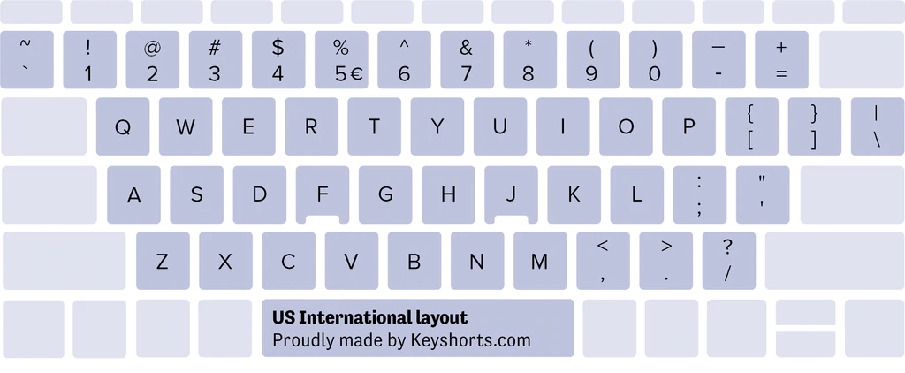

#### Keyboard layout: global and local parts

Any keyboard has local specific keys, and common keys for all languages (they are without titles on the picture below):



Most of common keys don’t have specific names in different languages. E.g. Escape, Tab, Caps Lock, Shift, Ctrl, Alt, Enter, Delete -- they all sound in 90% cases in English. Space, Arrows, F1-F12 usually have local names.

For now, to play audio of a key, we should put a sound file into `keyboardData/langCode/` folder. So it will be good, if we can use sounds from `keyboardData/en/` like `escape.mp3` for any language. But we will also leave the option to use local sounds for any of keys. `en/` sounds will be played only if other were not specified.

In programming such approach is called `fallback` -- when something doesn't work, and me make it works in another way.

Fortunately, `audio.play()` returns a promise, and we can catch error if file doesn't exist, and play another file.

Add to folder `keyboardData/en/` a "global layout" sounds. In our pice of keyboard they are `escape`, `left shift`, `right shift`, `tab`, `f1`-`f6`.

Now, if we try to play them, they will work only for `currentLang: 'en'`. In other languages after click/keydown will be played silent (joking).

In `Keyboard.js`, `methods`, `setActiveKey`, after `audio.play()` add:

Keyboard.js

```js
...
setActiveKey(keyContent) {
	const fileName = getAudioFileName(keyContent, this.shiftKey)
	const audio = new Audio(
		`../keyboardData/${this.currentLang}/${fileName}.mp3`
	)
	/* add catch after play:  */
	audio.play().catch(() => {
		if (this.currentLang !== 'en') {
			const audio = new Audio(`./keyboardData/en/${fileName}.mp3`)
			audio.play()
		}
	})
	...
}
```

Now new audio files that we added to folder `en/` sounds also for langs `ru` and `ar`. Except `ShiftRight` and `ShiftLeft`.

That is because of difference of `keyContent` for languages. In `en.js`, `ru.js` and `ar.js` keys `escape`, `tab`, `f1`-`f6` -- are identic and getAudioFileName returns the same name for any language. You can get these data from `keyboardData/en.js`, `ru.js`, `ar.js` and compare them, or even test the function `getAudioFileName` with each `keyContent` in the browser console.

Keys `ShiftLeft`, `ShiftRight` for `en` have additional field: `mainName`. Because of it for `en` file names will be `left shift`, `right shift`. For `ru` and `ar` file names will be generated from `code`: `shiftleft`, `shiftright`. We can add `mainName` as in `en` for each `global` key in every language keyboard data, end audios will sound. But it is a lot of work if we have lots of keyboards. It is better to improve our code.

##### Fallback `keyboardData.en`

That is how we get `keyContent` on `keydown` event.

Keyboard.js

```js
mounted() {
	this.getKeyboardData(this.currentLang)

	window.addEventListener('keydown', event => {
		event.preventDefault()
		const { code } = event
		const keyContent = this.keyboardData
			.flat()
			.find(elem => elem.code === code)
		this.setActiveKey(keyContent)
	})
...
}
```

We load `keyboardData` asynchronously from the file `/keyboardData/langCode.js`. Then we get from it `keyContent` by key `code`.

For `currentLang` we always have `keyboardData` -- it is loaded to component state on `mounted()` or when user clicked on `langCode` in `LanguageSwitcher`.

It would be good if `keyboardData` for `en` loaded by default at first time, will be always available as a fallback, when we haven't enough `keyContent` in a local `keyboardData`.

Let's refactor `Keyboard` state, to store there all loaded `keyboardData` for all langs. We find all `this.keyboardData` in code, and add to it `[lang]`. In template `this.` is'nt written, so we find there `keyboardData` and to it `currentLang`.

Keyboard.js methods

```js
	async getKeyboardData(lang) {
		const { default: keyboardData } = await import(
			`../keyboardData/${lang}.js`
		)
		/* add [lang]: */
		this.keyboardData[lang] = keyboardData
	}
```

Keyboard.js mounted

```js
/* add [currentLang] */
const keyContent = this.keyboardData[currentLang]
	.flat()
	.find(elem => elem.code === code)
```

Keyboard.js template

```html
<!-- add [currentLang] -->
<div
	v-for="(row, index) in keyboardData[currentLang]"
	:class="['row', 'row-'+(index+1)]"
></div>
```

Open the app. It should work as before.

##### Method `playKey`

Now we have immediate access to keyboards, that we opened before, without loading them every time. For now we need only `en` keyboardData as a fallback, which is loaded by default at first app opening. Let's made our code more universal by creating a new method:

Keyboard.js methods:

```js
getKeyContent(lang, code) {
	return this.keyboardData[lang].flat().find(elem => elem.code === code)
}
```

Rewrite code responsible for audio playing with this method:

Keyboard.js methods

```js
setActiveKey(keyContent) {
			const { code } = keyContent
			const { shiftKey, currentLang } = this

			// we created a new function
			// because we call all this code twice in this method
			const playKeyAudio = (lang, code, shiftKey) => {
				const keyContent = this.getKeyContent(lang, code)
				const fileName = getAudioFileName(keyContent, shiftKey)
				const audio = new Audio(`../keyboardData/${lang}/${fileName}.mp3`)
				return audio.play()// promise, we can catch error if file doesn't exist
			}

			playKeyAudio(currentLang, code, shiftKey).catch(() => { // fallback
				if (this.currentLang !== 'en') {
					playKeyAudio('en', code, shiftKey)
				}
			})

			this.activeKey = keyContent
			clearTimeout(this.timeout)
			this.timeout = setTimeout(() => (this.activeKey = { code: '' }), 1000)
		},
```

Check how app works. `Shift` should sound with any language layout.

But in such a code there is something wrong. Playing audio happens inside `setActiveKey` which is ok now. But what if we want to play audio without activating key, or activate key without playing audio?

Let's create a new method `playKey` and remove playing logic from `setActiveKey`.

Keyboard.js methods

```js
setActiveKey(keyContent) {
		this.activeKey = keyContent
		clearTimeout(this.timeout)
		this.timeout = setTimeout(() => (this.activeKey = { code: '' }), 1000)
	},
playKey(keyContent) {
	const { code } = keyContent
	const { shiftKey, currentLang } = this

	const playKeyAudio = (lang, code, shiftKey) => {
		const keyContent = this.getKeyContent(lang, code)
		const fileName = getAudioFileName(keyContent, shiftKey)
		const audio = new Audio(`../keyboardData/${lang}/${fileName}.mp3`)
		return audio.play()
	}

	playKeyAudio(currentLang, code, shiftKey).catch(() => {
		// fallback
		if (this.currentLang !== 'en') {
			playKeyAudio('en', code, shiftKey)
		}
	})
},
```

Find in code every `setActiveKey` call, and place after it `playKey`, to keep previous functionality.

Keyboard.js mounted

```js
window.addEventListener('keydown', event => {
	event.preventDefault()
	const { code } = event
	const keyContent = this.getKeyContent(this.currentLang, code)
	this.setActiveKey(keyContent)
	/* add: */
	this.playKey(keyContent)
})
```

Also pass it to `Key` component and use it there.

Keyboard.js template

```html
<vue-key ... :playKey="playKey" />
```

Key.js props

```js
props: {
	...
	setActiveKey: Function,
	},
```

Key.js methods

```js
keyClick(keyContent) {
			this.setActiveKey(keyContent)
			// add:
			this.playKey(keyContent)

			if (keyContent.code.includes('Shift')) {
				this.toggleShiftKey()
			}
		}
```

Check the app. It should work as before. But now code is more flexible, we can use it in more ways.
