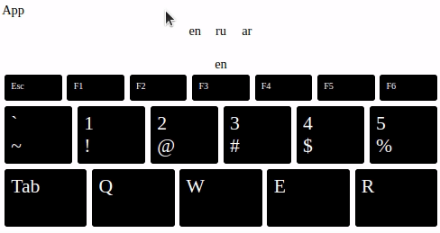
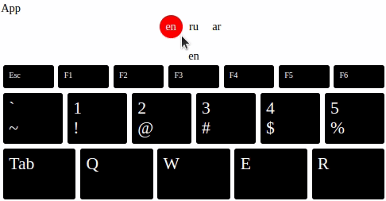
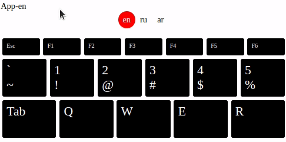
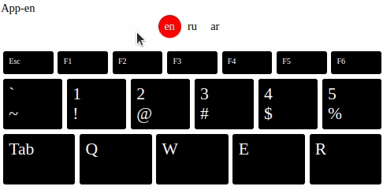
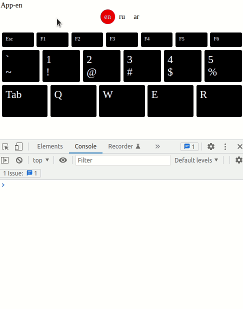

- [Interactivity](#interactivity)
	- [Reactive state, @click event, calling method](#reactive-state-click-event-calling-method)
	- [Conditional styling](#conditional-styling)
	- [Change parent state from a child](#change-parent-state-from-a-child)
	- [Switching keyboards (languages)](#switching-keyboards-languages)
		- [Another languages data](#another-languages-data)
		- [Dynamic import for `keyboardData`](#dynamic-import-for-keyboarddata)
	- [`Keydown` event handling](#keydown-event-handling)
		- [`activeKey` state](#activekey-state)
		- [Operational System (OS) language](#operational-system-os-language)
		- [Active key styling](#active-key-styling)
		- [Fade activeKey after a while](#fade-activekey-after-a-while)
		- [Set activeKey by click](#set-activekey-by-click)
			- [Method](#method)
			- [Event](#event)
			- [The key full info](#the-key-full-info)
			- [`shiftKey` state](#shiftkey-state)
			- [Holding `shift` style](#holding-shift-style)
			- [CSS animation (color)](#css-animation-color)
			- [Conditional rendering `v-if`](#conditional-rendering-v-if)
			- [Additional keyframe (0% 30% 100%)](#additional-keyframe-0-30-100)
			- [Animated resize (transform)](#animated-resize-transform)
			- [The value of the pressed key](#the-value-of-the-pressed-key)
	- [Play audio](#play-audio)
		- [Prepare audio files](#prepare-audio-files)
		- [HTML5 audio element](#html5-audio-element)
		- [Data model extension](#data-model-extension)
		- [Testing getAudioFileName](#testing-getaudiofilename)
		- [Dynamic audio playing](#dynamic-audio-playing)

## Interactivity

Interactivity it is when user interacts with an app, and see results.

Our app should handle user generated events.

### Reactive state, @click event, calling method

When we change a variable value, and it causes change in a visible app (view), it is called **reactive state**. Reactivity means connection between variable and view.

- In `vue` such **reactive variables** are placed in the method `data()`.
- The most common approach to change them — by **methods**.
- Methods are called from **event listeners** placed in a template (e.g. `@click`).

Let’s we add to `LangSwitcher`:

- a method `data()` with a returned property (state) `currentLang: 'en'` (‘en’ as default)
- a property `methods` with a new method `switchLang(lang)`
- in template — a new event handler @click to element `<div class="lang">`
- in template — a new `div` to display reactive variable `currentLang`. It is temporaty, after testing we’ll delete it.

LangSwitcher.js

```jsx
const LangSwitcher = {
	template: `<div class="langSwitcher">
                        <div 
                            v-for="lang in langs" 
                            class="lang"
                            @click="switchLang(lang)"
                        >
                            {{lang}}
                        </div>
                    </div>
                    <div style="text-align: center;">
                        {{currentLang}}
                    </div>`,
	props: {
		langs: Array
	},
	data() {
		return {
			currentLang: 'en'
		}
	},
	methods: {
		switchLang(lang) {
			this.currentLang = lang
		}
	}
}

export default LangSwitcher
```

`@click="switchLang(lang)"` -- by clicking on an element where it placed (`<div class=”lang”>`) will be called method `switchLang` with a parameter `lang`, which is particular to each `<div>` and can be ‘en’, ‘ru’ or ‘ar’.

That’s how a **dynamic generated elements changes a reactive state by user input (click)**.

Result:



You see, after click on a lang code, `currentLang` state of the component changes.

### Conditional styling

Instead of additional text with `currentLang` code we need a red round background under active lang.

When we apply some styling to an element, only if a particular condition is true, it is called — conditional styling.

`:class='["lang", {active: currentLang === lang}]'` this string will do all work for us.

1st element in the array is a string, that means that class `lang` will be attached to `<div>` in any case (without condition).

2nd element is object like `{styleName: boolean condition}`. Class “active” will be attached to `<div class="lang">` only if prop `lang` of element is equal to state `currentLang`.

In `styles.css` we defined before:

```css
.lang {
	width: 2rem;
	height: 2rem;
	border-radius: 1rem;
	...;
}

.langSwitcher .active {
	background-color: red;
	color: white;
}
```

That’s why the red round follows our clicks on lang codes — because of attaching and deattaching class `active`.

Result:



### Change parent state from a child

Another important approach to share data between components — is changing parent state from a child. It is kinda opposite to passing props from parent to child.

- In a parent we create a reactive state and a method to change it
- we pass this method to child as a prop
- we call it (with different params) from the child

When you call a method recieved from a prop, NOTICE that actually it happens where it was defined and passed down.

If the parent state was passed as a prop to multiple components, if we change this state (by method from any child, which received the method as a prop) — then all components with this state (as prop) will be updated. So that is how a little child component on the bottom of the hierarchy can globally affect on the whole app — by calling a method, that changes parent state.

In a small apps as our, it is common to have reactive state and main logic in the top level component as `<App>` and pass the state and methods to childs (`<Keyboard>`, `<LangSwitcher>`) as props.

For now `currentLang` is placed in `<LangSwitcher>`. But we need this value also in `<Keyboard>` and `<Key>`.

`<LangSwitcher>` and `<Keyboard>` are siblings (they haven’t relations parent-child, but have common parent). So, to share the state `currentLang` between siblings, we should lift it to a common ancestor `<App>`.

Let’s we move state `currentLang` and method `switchLang` from `<LangSwitcher>` to `<App>` and then pass them as props to `<LangSwitcher>` and use there.

Open `LangSwitcher.js` and remove `data()` and `methods`. Add to props: `currentLang`, `switchLang`.

```javascript
const LangSwitcher = {
	template: `<div class="langSwitcher">
                        <div 
                            v-for="lang in langs" 
                            :class='["lang", {active: currentLang === lang}]'
                            @click="switchLang(lang)"
                        >
                            {{lang}}
                        </div>
                    </div>`,
	props: {
		langs: Array,
		/* add: */
		currentLang: String,
		switchLang: Function
	}
	/* delete: 
	data() {
		return {
			currentLang: 'en'
		}
	},
	methods: {
		switchLang(lang) {
			this.currentLang = lang
		}
	} 
	*/
}

export default LangSwitcher
```

Open `App.js`. Add to `data()` a new state `currentLang: 'en'`. Paste whole `methods` from old `LangSwitcher.js`.

In the`template` pass to `<vue-lang-switcher>` 2 new props: `switchLang` and `currentLang`. Also add somewhere `{{currentLang}}` to test our changes.

App.js

```javascript
import Keyboard from './components/Keyboard.js'
import LangSwitcher from './components/LangSwitcher.js'

const App = {
	template: `App-{{currentLang}}
	<vue-lang-switcher 
		:langs="langs" 
		:switchLang="switchLang" 
		:currentLang="currentLang" 
	/>
	<vue-keyboard :keyboardData="keyboardData" />
	`,
	components: {
		'vue-lang-switcher': LangSwitcher,
		'vue-keyboard': Keyboard
	},
	mounted() {
		import(`./keyboardData/en.js`).then(result => {
			const { default: keyboardData } = result
			this.keyboardData = keyboardData
		})
	},
	data() {
		return {
			langs: ['en', 'ru', 'ar'],
			keyboardData: [],
			/* add: */
			currentLang: 'en'
		}
	},
	/* add: */
	methods: {
		switchLang(lang) {
			this.currentLang = lang
		}
	}
}

export default App
```

Result:



Notice, now when we do something in `LangSwitcher` it changes `App` state. We change the parent state from the child with method. The method we passed from parent to child as a prop.

### Switching keyboards (languages)

#### Another languages data

Open a folder `keyboardData`. Copy and paste there a file `en.js` twice. Rename clones to `ru.js` and `ar.js`. Change a content (copy from here or type).

ru.js

```javascript
const keyboard = [
	[
		{ code: 'Escape', label: 'Esc' },
		{ code: 'F1' },
		{ code: 'F2' },
		{ code: 'F3' },
		{ code: 'F4' },
		{ code: 'F5' },
		{ code: 'F6' }
	],
	[
		{
			code: 'Backquote',
			main: 'ё',
			shifted: 'Ё'
		},
		{
			code: 'Digit1',
			main: '1',
			shifted: '!',
			shiftedName: 'восклицательный знак'
		},
		{
			code: 'Digit2',
			main: '2',
			shifted: '"',
			shiftedName: 'двойная кавычка'
		},
		{
			code: 'Digit3',
			main: '3',
			shifted: '№',
			shiftedName: 'знак номер'
		},
		{
			code: 'Digit4',
			main: '4',
			shifted: ';',
			shiftedName: 'точка с запятой'
		},
		{
			code: 'Digit5',
			main: '5',
			shifted: '%',
			shiftedName: 'процент'
		}
	],
	[
		{ code: 'Tab' },
		{
			code: 'KeyQ',
			main: 'й',
			shifted: 'Й'
		},
		{
			code: 'KeyW',
			main: 'ц',
			shifted: 'Ц'
		},
		{
			code: 'KeyE',
			main: 'у',
			shifted: 'У'
		},
		{
			code: 'KeyR',
			main: 'к',
			shifted: 'К'
		}
	]
]

export default keyboard
```

ar.js

```javascript
const keyboard = [
	[
		{ code: 'Escape', label: 'Esc' },
		{ code: 'F1' },
		{ code: 'F2' },
		{ code: 'F3' },
		{ code: 'F4' },
		{ code: 'F5' },
		{ code: 'F6' }
	],
	[
		{
			code: 'Backquote',
			main: '٫',
			shifted: '٬',
			mainName: 'decimal point',
			shiftedName: 'inverted comma'
		},
		{
			code: 'Digit1',
			main: '١',
			shifted: '!',
			mainName: '1',
			shiftedName: 'exclamation mark'
		},
		{
			code: 'Digit2',
			main: '٢',
			shifted: '@',
			mainName: '2',
			shiftedName: 'at sign'
		},
		{
			code: 'Digit3',
			main: '٣',
			shifted: '#',
			mainName: '3',
			shiftedName: 'hash'
		},
		{
			code: 'Digit4',
			main: '٤',
			shifted: '$',
			mainName: '4',
			shiftedName: 'dollar sign'
		},
		{
			code: 'Digit5',
			main: '٥',
			shifted: '٪',
			mainName: '5',
			shiftedName: 'percent sign'
		}
	],
	[
		{ code: 'Tab' },
		{
			code: 'KeyQ',
			main: 'ض',
			shifted: 'َ',
			shiftedName: 'fatha'
		},
		{
			code: 'KeyW',
			main: 'ص',
			shifted: 'ً',
			shiftedName: ''
		},
		{
			code: 'KeyE',
			main: 'ث',
			shifted: 'ُ',
			shiftedName: ''
		},
		{
			code: 'KeyR',
			main: 'ق',
			shifted: 'ٌ',
			shiftedName: ''
		}
	]
]

export default keyboard
```

Arabic diacritic symbols don't look good in a code. But don't worry about it. It will work well for our purpuses.

#### Dynamic import for `keyboardData`

Open App.js and add there a new method `getKeyboardData`. Put call of this method to method `switchLang`, and `mounted()`.

```javascript
import Keyboard from './components/Keyboard.js'
import LangSwitcher from './components/LangSwitcher.js'

const App = {
	template: `App-{{currentLang}}
                <vue-lang-switcher 
                    :langs="langs" 
                    :switchLang="switchLang" 
                    :currentLang="currentLang" 
                />
                <vue-keyboard :keyboardData="keyboardData" />
	`,
	components: {
		'vue-lang-switcher': LangSwitcher,
		'vue-keyboard': Keyboard
	},
	mounted() {
		/* replace  
		import(`./keyboardData/en.js`).then(result => {
			const { default: keyboardData } = result
			this.keyboardData = keyboardData
		})
		*/
		this.getKeyboardData(this.currentLang)
	},
	data() {
		return {
			langs: ['en', 'ru', 'ar'],
			keyboardData: [],
			currentLang: 'en'
		}
	},
	methods: {
		switchLang(lang) {
			this.currentLang = lang
			/* add: */
			this.getKeyboardData(lang)
		},
		/* add: */
		async getKeyboardData(lang) {
			const { default: keyboardData } = await import(
				`./keyboardData/${lang}.js`
			)
			this.keyboardData = keyboardData
		}
	}
}

export default App
```

If you noticed `async/await` in the method `getKeyboardData` -- that is alternative syntax for promises. This code is asyncronous, because reading of a file takes time and we should wait for result to move furthere through our scenario.

Result:



With a couple lines of code we achived big improvment of functionality. That is because we organized code well: in a modular way with an intuitive props, methods and structure.

### `Keydown` event handling

In the file `App.js` add to `mounted()` an event listener on `keydown` :

```javascript
	mounted() {
		this.getKeyboardData(this.currentLang)

		/* add: */
		window.addEventListener('keydown', event => {
			e.preventDefault()
			console.log(event)
		})
	},
```

Save the file. Click with mouse on the app to make the window active to catch events from it.

Open Chrome dev tools tab `console`, and look at events. They will appear in a console when you press buttons on keyboard.



Experiment with different keys and see result. Expand `KeyboardEvent` and look at its properties. We need only 3 of them: `code`, `key`, and `shiftKey`.

Close console (Dev tools).

#### `activeKey` state

Open `App.js`, add there a new state `activeKey`. Write to it `{code, key, shiftKey}` from `event`. Add to template `activeKey` to see how it changes.

App.js

```javascript
import Keyboard from './components/Keyboard.js'
import LangSwitcher from './components/LangSwitcher.js'

const App = {
	template: `App-{{currentLang}} 
	<div>activeKey: {{activeKey}}</div>
	<vue-lang-switcher 
		:langs="langs" 
		:switchLang="switchLang" 
		:currentLang="currentLang" 
	/>
	<vue-keyboard :keyboardData="keyboardData" />
	`,
	components: {
		'vue-lang-switcher': LangSwitcher,
		'vue-keyboard': Keyboard
	},
	mounted() {
		this.getKeyboardData(this.currentLang)

		window.addEventListener('keydown', event => {
			event.preventDefault()
			/* add: */
			const { code, key, shiftKey } = event
			this.activeKey = { code, key, shiftKey }
		})
	},
	data() {
		return {
			langs: ['en', 'ru', 'ar'],
			keyboardData: [],
			currentLang: 'en',
			/* add: */
			activeKey: { code: '' }
		}
	},
	methods: {
		switchLang(lang) {
			this.currentLang = lang
			this.getKeyboardData(lang)
		},
		async getKeyboardData(lang) {
			const { default: keyboardData } = await import(
				`./keyboardData/${lang}.js`
			)
			this.keyboardData = keyboardData
		}
	}
}

export default App
```

Press `q, w` in all lang layouts (`en`, `ru`, `ar`).

Result:


#### Operational System (OS) language

You see, that the same events happen with any `currentLang`. That's because our web app state is not connected with OS language (for keyboard). And there is no technical ability to do that.

If a user switch language in OS (alt+shift, ctrl+shift) a property `key` will be different, but our app wont know what language is set in OS.

Anyway `code` is always the same. That's why we made it the identifier required in `data model`.

#### Active key styling

Open `styles.css` and add there after `.key` style:

```css
.key.active {
	background: red;
}
```

Pass state `activeKey` as a prop from `App` to `Keyboard`, from `Keyboard` to `Key`.

App.js template:

```html
<vue-keyboard ... :activeKey="activeKey" />
```

Keyboard.js template:

```html
<vue-key ... :activeKey="activeKey" />
```

Keyboard.js props:

```javascript
props: {
	...
	activeKey: Object,
}
```

Key.js props:

```javascript
props: {
	...
	activeKey: Object,
}
```

Now we can use `activeKey` inside `Key` component to apply conditional styling to one of the keys (active one).

Key.js template:

replace

```html
<div class="key"></div>
```

with:

```html
<div
	:class="[
				'key', 
				{active: activeKey.code === keyContent.code}
			]"
></div>
```

Style `key` applied to a button in any case.

Style `active` applied only if button's `code` is the same as a code of the `activeKey`.

Result:


#### Fade activeKey after a while

It works with any language. The problem is: if we pressed one button, and then don't press anything, `activeKey` stays forever. But we want it to fade after a while.

In `App.js` in `addEventListener`:

after

```javascript
this.activeKey = { code, key, shiftKey }
```

add

```javascript
setTimeout(() => (this.activeKey = { code: '' }), 1000)
```

That means, that after 1000 milliseconds (1 sec), `activeState` will be cleared.

Result:


Looking good, the active key automatically disappears after 1 sec.

But there is a problem, when we type fast several keys, one timer, started after pressing the first button, works for the last one too. If we type in 900 milliseconds `1, 2, 3, 4, 5`, `5` will disappear after 100 milliseconds, which is incorrect.


We respect `5` and will give to it the whole 1 second. To do that we need to store `timeout` when key pressed, and if another key is pressed, we'll clear old `timeout` and create a new one. That will guarantee 1 sec for any key.

App.js

replace

```js
setTimeout(() => (this.activeKey = { code: '' }), 1000)
```

with

```javascript
clearTimeout(this.timeout)
this.timeout = setTimeout(() => (this.activeKey = { code: '' }), 1000)
```

Now `5` also has 1 sec to show itself to the world:


#### Set activeKey by click

Some people doesn't have physical keyboard, but only screen one. And they also want to learn letters with our cool app.

To add `@click` event to `Key` we need to encapsulate activating of the key into a method.

##### Method

App.js methods:

```js
setActiveKey(keyContent) {
	this.activeKey = { code, key, shiftKey }
	clearTimeout(this.timeout)
	this.timeout = setTimeout(() => (this.activeKey = { code: '' }), 1000)
}
```

And call this new method from `mounted()`

App.js

```js
mounted() {
	this.getKeyboardData(this.currentLang)

	window.addEventListener('keydown', event => {
		event.preventDefault()
		const { code, key, shiftKey } = event
		this.setActiveKey({ code, key, shiftKey })
	})
},
```

##### Event

Send a new method `setActiveKey` to the journey:

`<App>` --> `<Keyboard>` --> `<key>`

App.js template:

```html
<vue-keyboard ... :setActiveKey="setActiveKey" />
```

Keyboard.js template:

```html
<vue-keyboard ... :setActiveKey="setActiveKey" />
```

Keyboard.js props:

```js
props: {
	...,
	setActiveKey: Function
}
```

Key.js props:

```js
props: {
	...,
	setActiveKey: Function
}
```

Now we see, that key became active also by mouse click (or tap from phone).


##### The key full info

On the previous gif animation you can notice, that `activeKey` is different for `keydown` and `@click`. E.g. for russian Й:

activeKey on keydown: `{ code: KeyQ, shiftKey: false }`

activeKey on @click: `{ code: KeyQ, main: "й", shifted:"Й" }`

That's because on `keydown` we set as a key `code` from event. On `@click` we set a key from our data `keyboardData/lang.js` -- which we filled with useful data.

In `Key` component it is easy to get this data -- it is a prop `keyContent`.

In `App` component we can extract key full info from `keyboardData` by `code`.

App.js mounted()

```js
...
window.addEventListener('keydown', event => {
	event.preventDefault()
	const { code, shiftKey } = event
	const keyContent = this.keyboardData
		.flat()
		.find(elem => elem.code === code)
	this.setActiveKey(keyContent)
})
...
```

`keyboardData` is 2D array (array with arrays). So we it flat -- 1D, and find key full info by `code`. Then pass it to method `setActiveKey`.

You can test it out: `keydown` and `@click` now returns almost the same value.

##### `shiftKey` state

`shiftKey` we get only with `keydown`. And for now there is no way to get `shiftKey` on `@click`. To make `keydown` and `@click` events equivalent, lets create a new app state: shiftKey. The purpose is the ability to change it from mouse/tap events, in addition to keyboard `keydown`.

Add to each `keyboardData/lang.js` a new row with 2 buttons:

en.js, ru.js, ar.js

```js
, [
	{
		code: 'ShiftLeft',
		label: 'Shift'
	},
	{
		code: 'ShiftRight',
		label: 'Shift'
	}
]
```

Result


Add new state to

App.js data()

```js
{
	...
	shiftKey: false
}
```

Add 2 event listeners, that change app state

App.js mounted()

```js
...
window.addEventListener('keydown', event => {
	if (event.key === 'Shift') {
		this.shiftKey = true
	}
})

window.addEventListener('keyup', event => {
	if (event.key === 'Shift') {
		this.shiftKey = false
	}
})
```

Add `shiftKey` state to template, to test how it works

App.js template

```html
...
<div>shiftKey: {{shiftKey}}</div>
...
```

Result


When we hold `shift` on keyboard, state `shiftKey` is `true` even when `activeKey` faded. When we `@click` `shift` by mouse, `shiftKey` is false, even when `activeKey` shows to us `shift` as active.

We can't hold shift on the screen as on physical keyboard. So we need state `shiftKey` that will be set by click on the screen button, and the app will think that we hold `shift` key. On the second click the app will think, that we released the button.

For that, in App.js add a new method `toggleShiftKey` and pass it down to `Key` (through the `Keyboard`)

App.js methods:

```js
toggleShiftKey(){
	this.shiftKey = !this.shiftKey
}
```

App.js template:

```html
<vue-keyboard ... :toggleShiftKey="toggleShiftKey"></vue-keyboard>
```

Keyboard.js template

```html
<vue-key ... :toggleShiftKey="toggleShiftKey"></vue-key>
```

Keyboard.js props

```js
{
	...
	toggleShiftKey: Function
}
```

Key.js props

```js
{
	...
	toggleShiftKey: Function
}
```

On key `@click` event will be fired multiple methods. So we need to create an additional method calling all these methods. And call it from the template.

Key.js methods

```js
methods: {
	keyClick(keyContent) {
		this.setActiveKey(keyContent)
		if (keyContent.code.includes('Shift')) {
			this.toggleShiftKey()
		}
	}
}

In Key.js template replace `@click="setActiveKey(keyContent)"` with `@click="keyClick(keyContent)"`

```

Key.js template

```html
<div
	:class="['key', {active: activeKey.code === keyContent.code}]"
	@click="keyClick(keyContent)"
>
	<div class="main">{{main}}</div>
	<div class="shifted">{{shifted}}</div>
</div>
```

Result


`shiftKey` state works fine with `keydown` and `@click`.

##### Holding `shift` style

Add to `styles.css` an especial style for pressed (not released) `shift` buttons.

styles.css

```css
.key.shiftKeyPressed {
	color: red;
}
```

To do that we need in `Key` component prop `shiftKey`. Pass it from `App` --> `Keyboard` --> `Key`

App.js template

```html
<vue-keyboard ... :shiftKey="shiftKey" />
```

Keyboard.js template

```html
<vue-key ... :shiftKey="shiftKey" />
```

Keyboard.js props

```js
props: {
	...
	shiftKey: Boolean,
},
```

Key.js props

```js
props: {
	...
	shiftKey: Boolean,
},
```

Add to `computed` 2 methods:

Key.js computed

```js
isActive() {
	return this.activeKey.code === this.keyContent.code
},
isShift() {
	return this.keyContent.code.includes('Shift')
}
```

They use these new values in a template:

Key.js template

```html
<div
	:class="[
				'key', 
				keyContent.code, 
				{ active: isActive }, 
				{ shiftKeyPressed: isShift && shiftKey && !isActive }
			]"
	@click="keyClick(keyContent)"
></div>
```

Style `shiftKeyPressed` will be applied to key if:

- it is `shift` (code: ShiftLeft or ShiftRight),
- `shiftKey: true` -- is holding,
- key is not active

Result


##### CSS animation (color)

We are doing our app for children first. Let's do active key appearance more attractive, to get better educational effect.

In `styles.css` create `pulse` animation. And replace `background-color` with it in `.key.active`.

styles.css

```css
.key.active {
	/* background-color: red; */
	animation: pulse 1s;
	position: relative;
}

@keyframes pulse {
	0% {
		background-color: black;
	}
	100% {
		background-color: red;
	}
}
```

Result


Now `background-color` changes smoothly. `@keyframes` shows how style properties changes over time. In our case from `black` to `red` in 1 second.

You can try to add to `@keyframes` also size change (`width`, `height`).

```css
@keyframes pulse {
	0% {
		background-color: black;
		width: 100%;
		height: 100%;
	}
	100% {
		width: 150%;
		height: 150%;
		background-color: red;
	}
}
```

And you will see, that it doesn't work. That's because `Key`s are displayed inside `flex` container.

##### Conditional rendering `v-if`

To achieve more freedom to animate active key size, we need a new independent element over old active `key`. We will display it only when key is active.

To show one element over another, the first one should be with style `position: relative` and second one with `position: absolute`.

styles.css

```css
.key {
  ... position: relative;
}

.key.active {
  animation: pulse 1s;
  position: absolute;
  z-index: 2;
}
```

`z-index:2` means that element will be displayed over elements with `z-index:1` (default z-index for app elements before).

Add to `Key` template conditional rendered element (active key).

Key.js template

```html
<div
	:class="[
					'key', 
					keyContent.code, 
					{ shiftKeyPressed: isShift && shiftKey && !isActive }
				]"
	@click="keyClick(keyContent)"
>
	<!-- add: -->
	<div v-if="isActive" :class="['key', 'active', keyContent.code]">
		<div>{{main}}</div>
		<div>{{shifted}}</div>
	</div>
	<div class="main">{{main}}</div>
	<div class="shifted">{{shifted}}</div>
</div>
```

Result


##### Additional keyframe (0% 30% 100%)

Now animated resizing works. But it is too slow. Let's make resizing 3 times shorter, and color pulse leave as it is.

styles.css

```css
@keyframes pulse {
	0% {
		background-color: black;
		width: 100%;
		height: 100%;
	}
	/* add: */
	30% {
		width: 150%;
		height: 150%;
	}
	100% {
		background-color: red;
		width: 150%;
		height: 150%;
	}
}
```

Result


Now resizing happens in 30% of 1 sec, and color pulsation in 100% of 1 sec.

##### Animated resize (transform)

Instead of `width/height` changing, lets we use another css prop `transform`.

styles.css

```css
.key.active {
	animation: pulse 1s;
	/* position (4 lines) : */
	position: absolute;
	top: 0;
	left: 0;
	z-index: 2;

	width: 100%;
	height: 100%;

	/* to compensate .key style: */
	padding: -0.5rem;
	margin: -0.2rem;

	/* to center content vertically and horizontally: */
	display: flex;
	align-items: center;
	justify-content: center;

	transform-origin: center;
}

@keyframes pulse {
	0% {
		background-color: black;
		transform: scale(100%);
	}
	30% {
		transform: scale(130%);
	}
	80% {
		transform: scale(130%);
	}
	100% {
		background-color: red;
		transform: scale(100%);
	}
}
```

Result


Now it looks better, isn't it?

##### The value of the pressed key

When key contains 2 values: `main` and `shifted` we don't want to activate both of them. Because we will sound each of them separately.

Let's create a new `computed` value, that returns only 1 value for active key:

Key.js computed

```js
value() {
	const { main, shifted, code } = this.keyContent
	return (this.shiftKey ? shifted : main) || code
}

```

If `shiftKey` is true (holding) value is `shifted`, otherwise is `main`. If value doesn't exist we return `code`.

Put this value to template:

Key.js template

```html
<div v-if="isActive" :class="['key', 'active', keyContent.code]">
	<div>{{value}}</div>
</div>
```

Result


Now we see only 1 value in the active box, which is correct. This is especially important since we want to sound all keyboard symbols.

### Play audio

#### Prepare audio files

We will use a short files for each key/value. If you haven't them yet, and didn't split files before, I highly recommend free audio editor `Audacity`. There you can select part of the audio and attach label to it `ctrl+b`.

For example you have 1 audio file with numbers from 0 to 9.


Then in menu: `File` --> `Export` --> `Export Multiple` --> `Split based on: Label`.

You will get files: `0.mp3`, `1.mp3`, ... `9.mp3`.

Create in the folder `keyboardData` a new folder `sounds`, and inside it folders `en`, `ru`, `ar`. Move to the folders audio files with numbers (for 3 langs).

#### HTML5 audio element

Open `App.js`. In `methods`, at the beginning of `setActiveKey` add 2 lines:

App.js methods

```js
setActiveKey(keyContent) {
  const audio = new Audio(`./keyboardData/en/1.mp3`);
  audio.play();
  ...
}
```

That's how audio element works.

Now when you click on any button, will be played one file `en/1.mp3`. You guess that we need to play different files. But there is a problem to identify them in our data model. If you remember, it is:

```javascript
const key = {
	code,
	label,
	main,
	shifted
}
```

#### Data model extension

Our data model isn't filled evenly. The keys have such different set of props

1. Only `code`

```js
{
	code: 'F1'
}
```

File name `F1.mp3` is good for such keys.

2. `main` and `shifted`

```js
{
	code: 'Digit1',
	main: '1',
	shifted: '!',
	// should to add:
	shiftedName: 'exclamation mark'
},
```

Here we cannot use `code` as before. Because there is only 1 `code`, but we need 2 audio files.

Furthermore `!` is forbidden symbol for file names. So it would be good to have an additional field `shiftedName: 'exclamation mark'`, that we'll use in file name.

For such `keyContent` we want to output `1.mp3` or `exclamation mark.mp3`

`mainName` is also necessary sometimes.

3. lower and upper case letters

```js
{
	code: 'KeyH',
	main: 'h',
	shifted: 'H'
},
```

It is enough here to have only 1 file `h.mp3` for both values `h` and `H`.

How do we fill our data now? We add to every `main` and `shifted` values that we can't or don't want to use as a file name, an additional values `mainName` and `shiftedName`.

#### Testing getAudioFileName

```js
const getAudioFileName = (keyContent, shiftKey) => {
	const { main, mainName, shifted, shiftedName, code } = keyContent

	let fileName

	if (shiftKey) {
		// will be returned 1 of 3 values (if it exist). priority to the first one
		fileName = shiftedName || shifted || code
	} else {
		fileName = mainName || main || code
	}

	// to have a guarantee, that everything is written in the same (lower) case
	return fileName.toLowerCase()
}
```

You can copy/paste the function, that you have written and not sure how it works, to console (`Chrome --> DevTools --> Console`).

Also copy to the console `keyContent` examples that we wrote before. Put them to the array `input`:

```js
const input = [
	{ code: 'F1' },
	{
		code: 'Digit1',
		main: '1',
		shifted: '!',
		shiftedName: 'exclamation mark'
	},
	{
		code: 'KeyH',
		main: 'h',
		shifted: 'H'
	}
]
```

Then call `getAudioFileName` with these data entities and different shiftKey, in the console.

```js
getAudioFileName(input[0], false) // f1
getAudioFileName(input[0], true) // f1
getAudioFileName(input[1], false) // 1
getAudioFileName(input[1], true) // exclamation mark
getAudioFileName(input[2], false) // h
getAudioFileName(input[2], true) // h
```

That is called `testing`. Programmers save such a code with:

- `input`,
- `call(input)`,
- `correct output`

to special files -- `tests`. Then, after codebase was changed, we run the `tests` to check that we haven't broken anything.

#### Dynamic audio playing

Add that function definition at the top of `App.js`, just after imports:

App.js

```js
import Keyboard from './components/Keyboard.js'
import LangSwitcher from './components/LangSwitcher.js'

const getAudioFileName = (keyContent, shiftKey) => {
	...
}
```

And call it when we before played static audio.

App.js methods

```js
setActiveKey(keyContent) {
	const fileName = getAudioFileName(keyContent, this.shiftKey)
	const audio = new Audio(
		`./keyboardData/${this.currentLang}/${fileName}.mp3`
	)
	audio.play()
	...
}
```

Now if you click on a different buttons, you'll hear a particular for a key sound, even when you switch languages. Don't forget, that for now we have files only for numbers `0, 1, ..., 9`. For playing Arabic numbers you should add their names to `keyboardData/ar.js`.

keyboardData/ar.js

```js
{
	code: 'Digit1',
	main: '١',
	// add:
	mainName: '1',
	shifted: '!'
},
...

```

Or, if you don't want to add `mainName`, you should rename files to `١.mp3`, `٢.mp3` e.t.c. So, our approach to file naming and data filling is flexible.
