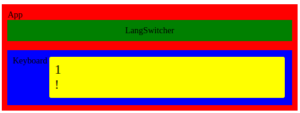
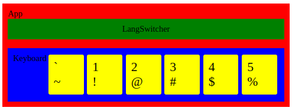
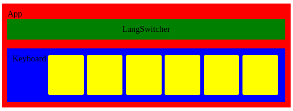
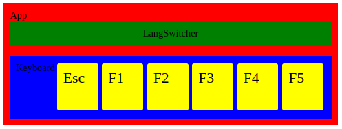
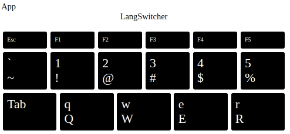
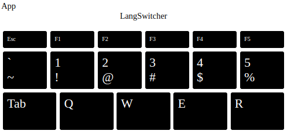

## Modularity 2. Passing props. Computed template variables

### Components (real)

- [Modularity 2. Passing props. Computed template variables](#modularity-2-passing-props-computed-template-variables)
  - [Components (real)](#components-real)
  - [passing prop (v-bind)](#passing-prop-v-bind)
  - [computed (template variables)](#computed-template-variables)

For now our components are colored rectangles with static content (text). In real components content is dynamic, passed by `props`.

Props are external parameters (variables) that we pass from parent to child.

The idea of a component is that we receive external data from parent (`props`), and put them into html-like template with empty slots for these props inside `{{ }}`.

### passing prop (v-bind)

Open `index.html`, copy a code of one of the keys, that we commented before, and paste it to the `Key` component template

Key.js

```javascript
const Key = {
	template: `
    <div class="key">
        <div class="main">1</div>
        <div class="shifted">!</div>
    </div>`
}

export default Key
```

We should tell `Key` about a new prop. And use the prop in the template.

Key.js

```js
const Key = {
	template: `
    <div class="key">
        <div class="main">
            {{ keyContent.main }}
        </div>
        <div class="shifted">
            {{ keyContent.shifted }}
        </div>
    </div>`,
	props: {
		keyContent: Object
	}
}

export default Key
```

1. We told component about a prop `props: {keyContent: Object}`
2. We told template where to place props by `{{ }}`.

Next we will pass prop from a parent.

Open `keyboardData/en.js` and copy data for a single key:

keyboardData/en.js

```javascript
{
	code: 'Digit1',
	main: '1',
	shifted: '!',
	mainName: 'one',
	shiftedName: 'exclamation mark'
}
```

We will pass this object to `Key` component as a prop `keyContent` from the parent `Keyboard`.

Keyboard.js

```javascript
import Key from './Key.js'

const keyData =
	/*paste here copied before data*/
	{
		code: 'Digit1',
		main: '1',
		shifted: '!',
		mainName: 'one',
		shiftedName: 'exclamation mark'
	}

const Keyboard = {
	template: `
    <div class="keyboard">
        Keyboard
        <vue-key :keyContent="keyData" />
    </div>`,
	components: {
		'vue-key': Key
	},
	/* put external data inside component */
	data() {
		return { keyData }
	}
}

export default Keyboard
```

Here we:

- pasted key data to `const keyData`
- made the component see this data in method `data(){}`
- passed `keyData` as a prop to child `Key` component `<vue-key :keyContent="keyData" />`.

Notice, when we pass prop, we use colon `:` before its name.

```html
<vue-key :keyContent="keyData" />
```

In that case framework interprets “keyData” as a variable name.

Otherwise, (without `:`) it would be interpreted as a string:

`<vue-key keyContent="keyData" />` -- Key component will receive string “keyData” instead of the object `keyData`.

Result:



Return to `Keyboard.js`. We already have all keys data in `keyboardData/en.js` so let’s import and use it, instead of a single key data:

Keyboard.js

```javascript
import Key from './Key.js'
import keyboardData from '../keyboardData/en.js'

const Keyboard = {
	template: `
    <div class="keyboard">
        Keyboard
        <vue-key :keyContent="keyboardData[1][0]" />
        <vue-key :keyContent="keyboardData[1][1]" />
        <vue-key :keyContent="keyboardData[1][2]" />
        <vue-key :keyContent="keyboardData[1][3]" />
        <vue-key :keyContent="keyboardData[1][4]" />
        <vue-key :keyContent="keyboardData[1][5]" />
    </div>`,
	components: {
		'vue-key': Key
	},
	data() {
		return { keyboardData }
	}
}

export default Keyboard
```

Now we have less code and more keys. If change `Key` component, all keys in the app will be changed.

Result



### computed (template variables)

If we try to display first row `keyboardData[0]` (Esc, F1, F2, …)

```javascript
    ...
    template: `
    <div class="keyboard">
        <vue-key :keyContent="keyboardData[0][0]" />
        <vue-key :keyContent="keyboardData[0][1]" />
        <vue-key :keyContent="keyboardData[0][2]" />
        <vue-key :keyContent="keyboardData[0][3]" />
        <vue-key :keyContent="keyboardData[0][4]" />
        <vue-key :keyContent="keyboardData[0][5]" />
    </div>`,
    ...
```

we will get empty yellow rectangles:



That’s because these keys doesn’t have `main` or `shifted` values:

```javascript
;[
	{ code: 'Escape', label: 'Esc' },
	{ code: 'F1' },
	{ code: 'F2' },
	{ code: 'F3' },
	{ code: 'F4' },
	{ code: 'F5' }
]
```

So we need to compute them from other params: `code` and `label`. Vue component has especial property `computed` for such cases.

Key.js

```javascript
const Key = {
    ...,
	props: {
		keyContent: Object
	},
    /* add: */
	computed: {
		main() {
			/*
			Code line below is called `destructuring`,
			because we destructure an object `this.keyContent`
			into 3 separate constants.
			*/
			const { main, label, code } = this.keyContent

			return label || main || code
/*
|| is a logical `or` operator. The line above is `or chain`. If `label` exists, it will be returned. If label doesn't exist, but `main` exists -- will be returned `main`. If label and main don't exist, will be returned `code`.
*/
		},
		shifted() {
			const { shifted } = this.keyContent
			return shifted
		}
	}
}

export default Key
```

We added to component object a new property `computed` with 2 methods: `main()` and `shifted()`. We also changed `template` to use this new values:

`{{keyboardData.main}}` —> `{{main}}`

`{{keyboardData.shifted}}` —> `{{shifted}}`

Result:



Before we output all rows, remove all temporary styles, that we added to see how component hierarchy works. Remove these lines from the end of styles.css.

styles.css

```css
#app {
	background-color: red;
	padding: 10px;
}

.langSwitcher {
	background-color: green;
	padding: 10px;
}

.keyboard {
	background-color: blue;
	padding: 10px;
	display: flex;
}

.key {
	background-color: yellow;
	padding: 10px;
	color: black;
}
```

Let’s output all rows from our data model. Put code below to `Keyboard` template

Keyboard.js template

```html
<div class="keyboard">
	<div class="row row-1">
		<vue-key :keyContent="keyboardData[0][0]" />
		<vue-key :keyContent="keyboardData[0][1]" />
		<vue-key :keyContent="keyboardData[0][2]" />
		<vue-key :keyContent="keyboardData[0][3]" />
		<vue-key :keyContent="keyboardData[0][4]" />
		<vue-key :keyContent="keyboardData[0][5]" />
	</div>
	<div class="row row-2">
		<vue-key :keyContent="keyboardData[1][0]" />
		<vue-key :keyContent="keyboardData[1][1]" />
		<vue-key :keyContent="keyboardData[1][2]" />
		<vue-key :keyContent="keyboardData[1][3]" />
		<vue-key :keyContent="keyboardData[1][4]" />
		<vue-key :keyContent="keyboardData[1][5]" />
	</div>
	<div class="row row-3">
		<vue-key :keyContent="keyboardData[2][0]" />
		<vue-key :keyContent="keyboardData[2][1]" />
		<vue-key :keyContent="keyboardData[2][2]" />
		<vue-key :keyContent="keyboardData[2][3]" />
		<vue-key :keyContent="keyboardData[2][4]" />
	</div>
</div>
```

We wrapped rows with `<div class="row row-{{index}}">...</div>`.

Result:



Last line looks not correct.

For languages with upper case letters (e.g. Cyrillic, Latin alphabets), we should show in main slot `shifted` value (uppercase), and don't show `main` value at all. Otherwise, our keyboard will look unrealistic. Let's add a function `getKeyLabels(keyContent)` that does all this work for us:

Key.js

```javascript
const getKeyLabels = keyContent => {
	const { main = '', shifted = '', label, code } = keyContent
	const isUpperCaseLang = main.toUpperCase() === shifted
	const mainOutput = isUpperCaseLang ? shifted : main
	const shiftedOutput = isUpperCaseLang ? '' : shifted

	return {
		main: label || mainOutput || code,
		shifted: shiftedOutput
	}
}

const Key = {
	template: `
    <div class="key">
        <div class="main">{{main}}</div>
        <div class="shifted">{{shifted}}</div>
    </div>`,
	props: {
		keyContent: Object
	},
	computed: {
		main() {
			const { main } = getKeyLabels(this.keyContent)
			return main
		},
		shifted() {
			const { shifted } = getKeyLabels(this.keyContent)
			return shifted
		}
	}
}

export default Key
```

In `main()` and `shifted()` we use the new function `getKeyLabels`.

Result is ok:



### Entire code after the chapter

[5. Modularity 2. Passing props. Computed template variables](https://github.com/ApayRus/keyboard/tree/5.-Modularity-2.-Passing-props.-Computed-template-variables)
