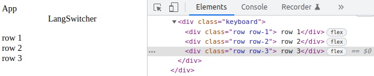
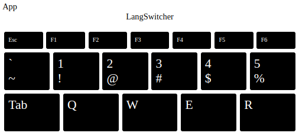
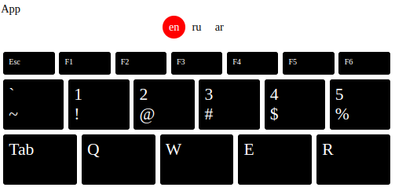
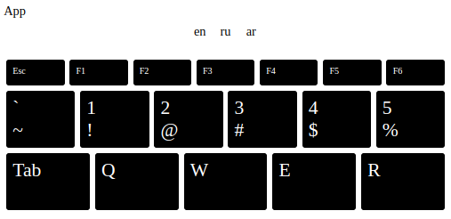

### Components (real)

- [Components (real)](#components-real)
  - [Key](#key)
    - [passing prop (v-bind)](#passing-prop-v-bind)
    - [computed (template variables)](#computed-template-variables)
  - [Rows](#rows)
    - [loop in template (v-for)](#loop-in-template-v-for)
    - [1st loop — rows of the keyboard](#1st-loop--rows-of-the-keyboard)
    - [2nd loop — keys of a row](#2nd-loop--keys-of-a-row)
  - [LangSwitcher — refactor with props and v-for](#langswitcher--refactor-with-props-and-v-for)
  - [Dynamic import of `keyboardData`](#dynamic-import-of-keyboarddata)
- [Conclusion](#conclusion)

For now our components are a colored rectangles with some static content (text). In real components all content is dynamic, passed by `props`.

Props are external params (variables) that we pass from parent to child.

The idea of a component is that we recieve external data from parent (`props`), and put them into html-like template with empty slots for these props.

#### Key

##### passing prop (v-bind)

Open `index.html`, copy one of the key code, that we commented before, and paste it to template in

Key.js

```javascript
const Key = {
	template: `<div class="key">
                                <div class="main">1</div>
                                <div class="shifted">!</div>
                            </div>`
}

export default Key
```

We described our ["Data model"](#data-model) in a section above. Open `keyboardData/en.js` and find the data for a single key:

keyboardData/en.js

```javascript
{
	code: 'Digit1',
	main: '1',
	shifted: '!',
	mainName: 'one',
	shiftedName: 'exclamation mark'
}
```

copy it.

We will pass this object to `Key` component as a prop `keyContent`.

Keyboard.js

```javascript
import Key from './Key.js'

const keyData = {
	/*paste here copied data*/ code: 'Digit1',
	main: '1',
	shifted: '!',
	mainName: 'one',
	shiftedName: 'exclamation mark'
}

const Keyboard = {
	template: `<div class="keyboard">
                        Keyboard
                        <vue-key :keyContent="keyData" />
		    </div>`,
	components: {
		'vue-key': Key
	},
	data() {
		return { keyData }
	}
}

export default Keyboard
```

Here we:

- described data of Key in `const keyData`
- made the component see this data with `data(){}` method
- passed `keyData` as a prop to child `Key` component

Notice, when we pass prop, we use colon `:` before its name.

```html
<vue-key :keyContent="keyData" />
```

In that case framework interpet “keyData” as a variable name.

Otherwise (wihout `:`) it would be interpreted as a string.

`<vue-key keyContent="keyData" />` —> Key component will recieve string “keyData” instead of the object `keyData`.

Now we should warn `Key` about a new prop.

Key.js

```javascript=
const Key = {
  template: `<div class="key">
                        <div class="main">
                            {{ keyContent.main }}
                        </div>
                        <div class="shifted">
                            {{ keyContent.shifted }}
                        </div>
                    </div>`,
  props: {
    keyContent: Object
  }
}

export default Key
```

1. We told component about a prop `props: {keyContent: Object}`
2. We told template how to use props by `{{ }}`.

Result:


Return to `Keyboard.js`. We already have all key data in `keyboardData/en.js` so let’s import and use it, instead of a single key data:

Keyboard.js

```javascript
import Key from './Key.js'
import keyboardData from '../keyboardData/en.js'

const Keyboard = {
	template: `<div class="keyboard">
                        Keyboard
                        <vue-key :keyContent="keyboardData[1][0]" />
                        <vue-key :keyContent="keyboardData[1][1]" />
                        <vue-key :keyContent="keyboardData[1][2]" />
                        <vue-key :keyContent="keyboardData[1][3]" />
                        <vue-key :keyContent="keyboardData[1][4]" />
                        <vue-key :keyContent="keyboardData[1][5]" />
                    </div>`,
	components: {
		'vue-key': Key
	},
	data() {
		return { keyboardData }
	}
}

export default Keyboard
```

Now we have less code and more keys:


##### computed (template variables)

If we try to display first row `keyboardData[0]` (Esc, F1, F2, …)

```javascript
    ...
    template: `<div class="keyboard">
                        <vue-key :keyContent="keyboardData[0][0]" />
                        <vue-key :keyContent="keyboardData[0][1]" />
                        <vue-key :keyContent="keyboardData[0][2]" />
                        <vue-key :keyContent="keyboardData[0][3]" />
                        <vue-key :keyContent="keyboardData[0][4]" />
                        <vue-key :keyContent="keyboardData[0][5]" />
                </div>`,
    ...
```

we will get empty yellow rectangles:


That’s because these keys doesn’t have `main` or `shifted` values:

```javascript
;[
	{ code: 'Escape', label: 'Esc' },
	{ code: 'F1' },
	{ code: 'F2' },
	{ code: 'F3' },
	{ code: 'F4' },
	{ code: 'F5' }
]
```

So we need to compute them from other params: `code` and `label`. Vue component has especial property `computed` for such computations.

Key.js

```javascript
const Key = {
	template: `<div class="key">
                        <div class="main">
                            {{main}}
                        </div>
                        <div class="shifted">
                            {{shifted}}
                        </div>
                    </div>`,
	props: {
		keyContent: Object
	},
	computed: {
		main() {
			const { main, label, code } = this.keyContent
			return label || main || code
		},
		shifted() {
			const { shifted } = this.keyContent
			return shifted
		}
	}
}

export default Key
```

We added to component object a new property `computed` with 2 methods: `main()` and `shifted()`. Also we changed `template` to use this new values:

`{{keyboardData.main}}` —> `{{main}}`

`{{keyboardData.shifted}}` —> `{{shifted}}`

Result:


Before we output all rows, remove all temporary styles, that we added to see how component hierarchy works. Remove these lines from the end of

styles.css

```css
#app {
	background-color: red;
	padding: 10px;
}

.langSwitcher {
	background-color: green;
	padding: 10px;
}

.keyboard {
	background-color: blue;
	padding: 10px;
	display: flex;
}

.key {
	background-color: yellow;
	padding: 10px;
	color: black;
}
```

Let’s ouput all rows from our data model

Keyboard.js

```javascript
...
template: `<div class="keyboard">
                <div class="row row-1">
                    <vue-key :keyContent="keyboardData[0][0]" />
                    <vue-key :keyContent="keyboardData[0][1]" />
                    <vue-key :keyContent="keyboardData[0][2]" />
                    <vue-key :keyContent="keyboardData[0][3]" />
                    <vue-key :keyContent="keyboardData[0][4]" />
                    <vue-key :keyContent="keyboardData[0][5]" />
                </div>
                <div class="row row-2">
                    <vue-key :keyContent="keyboardData[1][0]" />
                    <vue-key :keyContent="keyboardData[1][1]" />
                    <vue-key :keyContent="keyboardData[1][2]" />
                    <vue-key :keyContent="keyboardData[1][3]" />
                    <vue-key :keyContent="keyboardData[1][4]" />
                    <vue-key :keyContent="keyboardData[1][5]" />
                </div>
                <div class="row row-3">
                    <vue-key :keyContent="keyboardData[2][0]" />
                    <vue-key :keyContent="keyboardData[2][1]" />
                    <vue-key :keyContent="keyboardData[2][2]" />
                    <vue-key :keyContent="keyboardData[2][3]" />
                    <vue-key :keyContent="keyboardData[2][4]" />
                </div>
            </div>`,
...
```

We wrapped rows with `<div class="row row-{{index}}">...</div>`.

Result:


Last line looks not correct.

For languages with upper case letters (e.g. cyrillic, latin alphabets), we should show in main slot `shifted` value (uppercase), and don't show `main` value at all. Otherwise it makes our keaboard lookin unrealistic and overwhelmed. We add function `getKeyLabels(keyContent)` that does all this work for us:

Key.js

```javascript
const getKeyLabels = keyContent => {
	const { main = '', shifted = '', label, code } = keyContent
	const isUpperCaseLang = main.toUpperCase() === shifted
	const mainOutput = isUpperCaseLang ? shifted : main
	const shiftedOutput = isUpperCaseLang ? '' : shifted

	return {
		main: label || mainOutput || code,
		shifted: shiftedOutput
	}
}

const Key = {
	template: `<div class="key">
                        <div class="main">{{main}}</div>
                        <div class="shifted">{{shifted}}</div>
                    </div>`,
	props: {
		keyContent: Object
	},
	computed: {
		main() {
			const { main } = getKeyLabels(this.keyContent)
			return main
		},
		shifted() {
			const { shifted } = getKeyLabels(this.keyContent)
			return shifted
		}
	}
}

export default Key
```

In `main()` and `shifted()` we use the new function `getKeyLabels`.

Result is ok:


#### Rows

##### loop in template (v-for)

Keyboard.js

Did you already think that it is annoying to ouput data with template in such way:

Keyboard.js

```javascript
...
template: `<div class="keyboard">
                <div class="row row-1">
                    <vue-key :keyContent="keyboardData[0][0]" />
                    <vue-key :keyContent="keyboardData[0][1]" />
                    <vue-key :keyContent="keyboardData[0][2]" />
                    <vue-key :keyContent="keyboardData[0][3]" />
                    <vue-key :keyContent="keyboardData[0][4]" />
                    <vue-key :keyContent="keyboardData[0][5]" />
                </div>
                <div class="row row-2">
                    <vue-key :keyContent="keyboardData[1][0]" />
                    <vue-key :keyContent="keyboardData[1][1]" />
                    <vue-key :keyContent="keyboardData[1][2]" />
                    <vue-key :keyContent="keyboardData[1][3]" />
                    <vue-key :keyContent="keyboardData[1][4]" />
                    <vue-key :keyContent="keyboardData[1][5]" />
                </div>
                <div class="row row-3">
                    <vue-key :keyContent="keyboardData[2][0]" />
                    <vue-key :keyContent="keyboardData[2][1]" />
                    <vue-key :keyContent="keyboardData[2][2]" />
                    <vue-key :keyContent="keyboardData[2][3]" />
                    <vue-key :keyContent="keyboardData[2][4]" />
                </div>
            </div>`,
...
```

`v-for` directive allows us to loop elements in template.

We could guess by template structure , that there are 2 nested loops.

- 1st for rows
- 2nd for keys inside the row

##### 1st loop — rows of the keyboard

First let’s ouput just row containers.

Keyboard.js

```javascript
import Key from './Key.js'
import keyboardData from '../keyboardData/en.js'

const Keyboard = {
	template: `<div class="keyboard">
                        <div 
                            v-for="(row, index) in keyboardData"
                            :class="['row', 'row-'+(index+1)]" 
                        >
                            row {{index+1}}
                        </div>
                    </div>`,
	components: {
		'vue-key': Key
	},
	data() {
		return { keyboardData }
	}
}

export default Keyboard
```

`v-for="(row, index) in keyboardData"` loops through `keyboardData` array.

On each iteration `v-for` creates the same element (like element that contains `v-for`), with 2 new params: `index` and `row` that we can use inside our template. For now we use only index.

Result:



`:class="['row', 'row-'+(index+1)]"` generates `class="row row-1"` e.t.c. Сolon `:` tells framework that class value should be interpreted as a varible, not string. We use in class a variable `index` gotten from `v-for`.

On the image above there is opened Developer tools. (In browser click mouse right button —> Inspect).

In the code (DevTools tab `elements`) we see that each row are represented by a `div` with classes `row` and `row-index`. That’s important for us, because 1st row has different styles: smaller buttons and font size, if you remember.

```html
<vue-key v-for="keyContent in row" :keyContent="keyContent" />
```

##### 2nd loop — keys of a row

In `Keyboard.js` let’s replace `row {{index+1}}` with another loop with keys.

This template part recieves `row` from the loop before, and makes another loop for keys of the `row`.

Keyboard.js

```javascript
import Key from './Key.js'
import keyboardData from '../keyboardData/en.js'

const Keyboard = {
	template: `<div class="keyboard">
                        <div 
                            v-for="(row, index) in keyboardData" 
                            :class="['row', 'row-'+(index+1)]"
                        >
                        <vue-key 
                            v-for="keyContent in row" 
                            :keyContent="keyContent" 
                        />
                        </div>
                    </div>`,
	components: {
		'vue-key': Key
	},
	data() {
		return { keyboardData }
	}
}

export default Keyboard
```

Result:



Add to `keyboardData/en.js` a new key F6 and you'll see the result immidiatly.

Now we don’t care even if our keyboard data contains hundreds of rows and keys — they will be displayed automatically by the 2 loops, with these 25 lines of code. **We separated view and data**.

#### LangSwitcher — refactor with props and v-for

Open `index.html` and copy commented code for `LangSwitcher`, then paste it to `template` in

LangSwitcher.js

```javascript
const LangSwitcher = {
	template: `<div class="langSwitcher">
                            <div class="lang active">en</div>
                            <div class="lang">ru</div>
                            <div class="lang">ar</div>
                    </div>`
}

export default LangSwitcher
```

Result:



The idea is to move the red round to the lang code that we clicked. Also we need to store selected lang in some variable. Smells as reactivity, yeah?

But first we rewrite LangSwitcher with `props` and `v-for`.

In `App.js` we add a new param `langs` to `data()`. Then in `template` we pass it to `<vue-lang-switcher />`

App.js

```javascript
import Keyboard from './components/Keyboard.js'
import LangSwitcher from './components/LangSwitcher.js'

const App = {
	template: `App 
	<vue-lang-switcher :langs="langs" />
	<vue-keyboard />
	`,
	components: {
		'vue-lang-switcher': LangSwitcher,
		'vue-keyboard': Keyboard
	},
	data() {
		return {
			langs: ['en', 'ru', 'ar']
		}
	}
}

export default App
```

In `<LangSwitcher.js>` we recieve this new param (array) `langs`, and ouput it in a loop with `v-for`.

LangSwitcher.js

```javascript
const LangSwitcher = {
	template: `<div class="langSwitcher">
                        <div 
                            v-for="lang in langs" 
                            class="lang"
                        >
                            {{lang}}
                        </div>
                    </div>`,
	props: {
		langs: Array
	}
}

export default LangSwitcher
```

Result:



The red round disappeared because style `active` not attached to any element.

#### Dynamic import of `keyboardData`

For now we have only 1 keyboard layout -- English (en). But then we will have different layouts (langs), so we need a feature to load them from different files.

Open `Keyboard.js` and:

- add `mounted()`, and load there `keyboardData` from a file
- update state with received data

Keyboard.js

```js
import Key from './Key.js'
/* delete: 
import keyboardData from '../keyboardData/en.js'
* we receive it from prop 
*/

const Keyboard = {
	template: `
  <div class="keyboard">
      <div 
          v-for="(row, index) in keyboardData" 
          :class="['row', 'row-'+(index+1)]"
      >
          <vue-key 
              v-for="keyContent in row" 
              :keyContent="keyContent" 
          />
      </div>
  </div>
`,
	components: {
		'vue-key': Key
	},
	/* add: */
	mounted() {
		/* dynamic import from file */
		import(`./keyboardData/en.js`).then(result => {
			const { default: keyboardData } = result
			/* update state with received data */
			this.keyboardData = keyboardData
		})
	},
	data() {
		return { keyboardData: [] }
	}
}

export default Keyboard
```

Method `mounted()` will be called when user opens the app at the first time.

`import('path-to-file')` works as `import` in the top of a page. But you can put it anywhere and call it anytime. It is a promise (works asynchronous), so it returns after a while a `result` -- object `{default: }` with code from an external module. We wait it and `.then` we use received code (`keyboardData/en.js`) to update our `Keyboard` state.

If you have done everything right, the app will work just as before, without any visible changes. But we made our code better. Now we import `keyboardData` dynamically, that allows us to switch between different language keyboards on a next steps.

### Conclusion

What we coded until now are a static elements, that doesn’t react on user input, and doesn’t change dynamically (except dynamic import of a `keyboardData`, but for now it happens without user interaction).

By using components with props we made our code modular.

By using loops in templates we made code short, clear, extensible, and maintainable. Now we can display data of any length with a small template within a loop.
